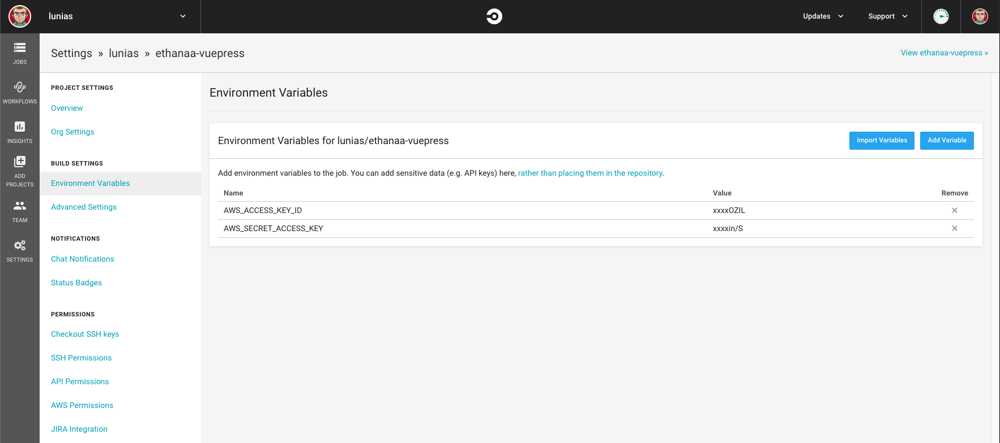
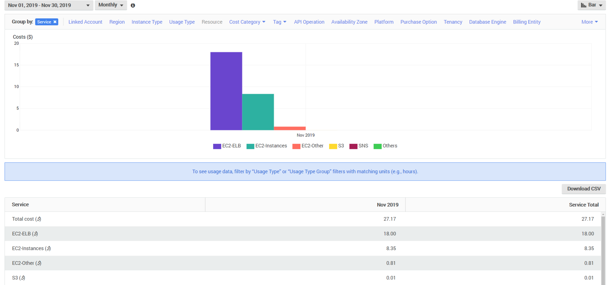
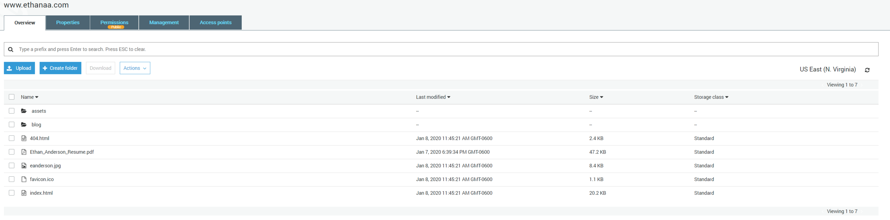
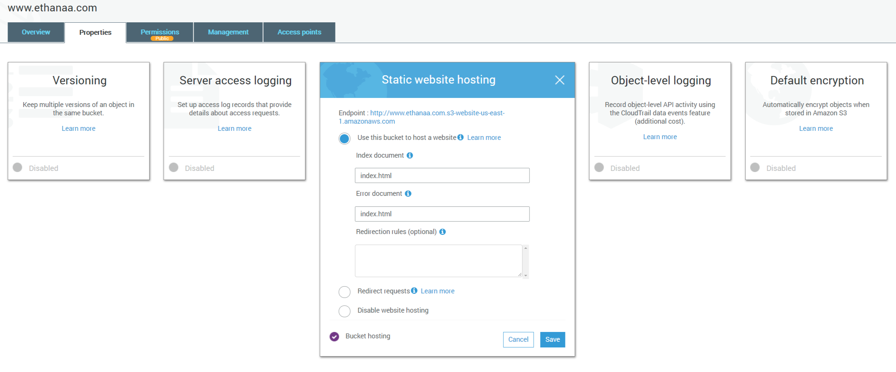
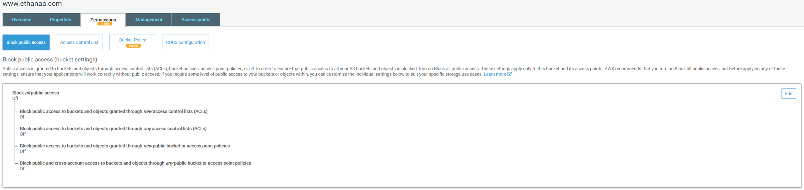
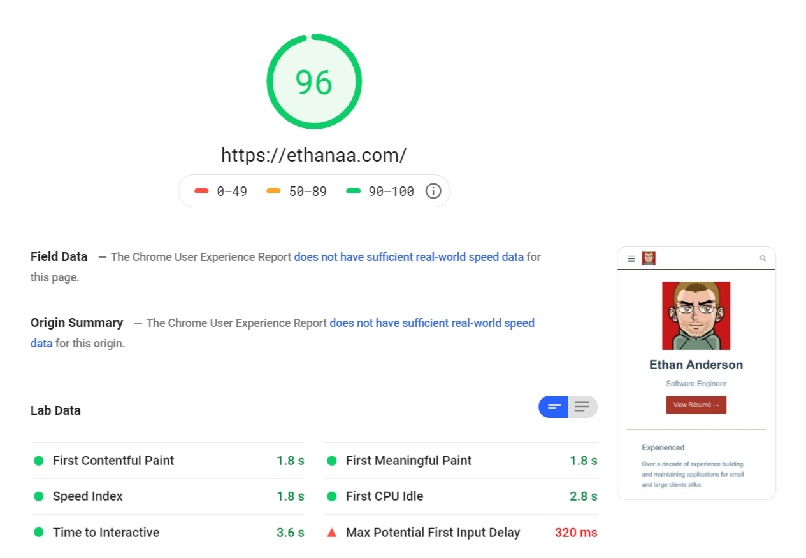
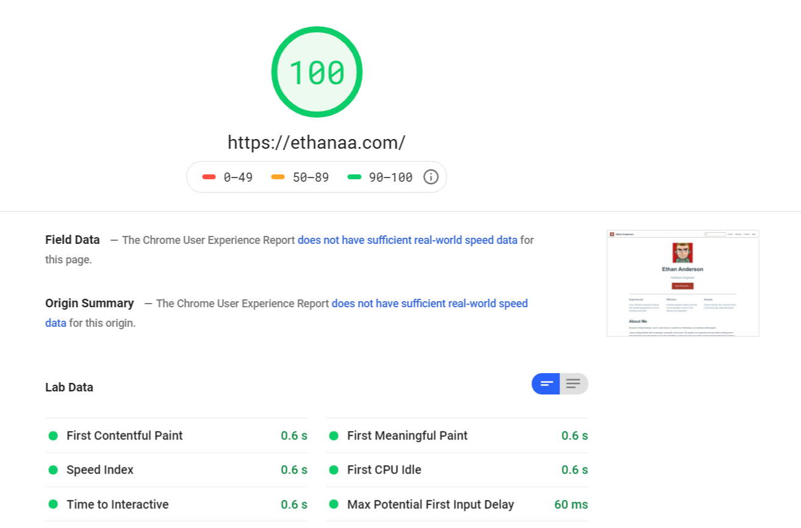

# 1/9/2020

## Continuous Deployment with CircleCI and s3deploy

Now I have a simple to edit, static site that meets my résumé hosting and
blogging needs; but deployment is currently a bit tedious. Manually copying the
built files into the S3 bucket and invalidating the CloudFront distribution
takes too much time and requires too much use of my mouse to encourage
consistent updates. :wink:

So, what am I after? I think a desirable workflow looks something like:

1. `yarn docs:dev`
2. Write a blog post
3. Commit and push the repository to [GitHub](https://github.com/lunias/ethanaa-vuepress)
4. `yarn docs:build` is run automatically
5. The output (`docs/.vuepress/dist/`) of the build is uploaded to AWS S3
6. The CloudFront distribution in front of the S3 bucket is invalidated

Steps 1, 2, and 3 are already doable; so what about 4, 5, and 6?

Sounds like a job for [CircleCI](https://circleci.com/)! CircleCI integrates
with your existing GitHub repository to provide a configurable build / deploy
pipeline as a service. It also offers a free plan which will work for us in this
case.

In order to perform the AWS operations of syncing the bucket and invalidating
the distribution, I've chosen to use the often recommended
[bep/s3deploy](https://github.com/bep/s3deploy) script. It's kind of like `aws
s3 sync` but optimized for static sites.

Setting up CircleCI is as simple as making an account and using their interface
to set up a project tracking your GitHub repository. Once that's complete, we
will need to create `.circleci/config.yml` in the root of the repository; but
before we get to editing it we need to satisfy a prerequisite first: creating a
deployment service account.

### AWS IAM User

First we need to create an IAM User in AWS that will represent the service
account under which s3deploy will do its work.

Add a user with the "Programmatic access" type. Click "Next: Permissions",
select "Attach existing policies directly", and then click on the "Create
policy" button.

The policy that I'm using looks like:

```json
{
    "Version": "2012-10-17",
    "Statement": [
        {
            "Effect": "Allow",
            "Action": [
                "s3:ListBucket",
                "s3:GetBucketLocation"
            ],
            "Resource": "arn:aws:s3:::www.ethanaa.com"
        },
        {
            "Effect": "Allow",
            "Action": [
                "s3:PutObject",
                "s3:DeleteObject",
                "s3:PutObjectAcl"
            ],
            "Resource": "arn:aws:s3:::www.ethanaa.com/*"
        },
        {
            "Effect": "Allow",
            "Action": [
                "cloudfront:GetDistribution",
                "cloudfront:CreateInvalidation"
            ],
            "Resource": "*"
        }
    ]
}
```

It allows s3deploy to fetch the information that it needs about the state of the
S3 bucket, insert / update / delete bucket contents, and invalidate our
CloudFront distribution (CDN cache) so that our changes are immediately
available.

**Make sure to download / copy the credentials for the new user to a file. We'll
need both the `AWS_ACCESS_KEY_ID` and the `AWS_SECRET_ACCESS_KEY` for the
configuration of our CircleCI project's build environment.**

### CircleCI

Set both `AWS_ACCESS_KEY_ID` and `AWS_SECRET_ACCESS_KEY` to the values
associated with the newly created deployment service account IAM User.



Now edit `.circleci/config.yml`:

<<< @/.circleci/config.yml

I've separated the config into 3 jobs: `install-dependencies`, `build`, and `deploy`.

Commit the code and push it up to GitHub to trigger a build!

# 1/8/2020

## Conversion to a Static Site with VuePress and AWS S3

I've been working a lot lately with AWS and I figured it was high time that I
leveraged some of that newfound kowledge to improve my own website. I set out
with 3 goals in mind:

1. Reduce my monthly AWS bill
2. Improve performance
3. Create a better experience for both the user as well as the developer (me :smile:)

First is to address my current cost of operating a site which is quite simple in
scope. As of last November, I'm clearly paying too much considering other
hosting options for a personal résumé and blog.



I had originally chosen to implement
[ethanaa.com](https://github.com/lunias/ethanaa) as a [Spring
Boot](https://spring.io/projects/spring-boot) /
[Angular.js](https://angular.io/) application and serve it using [AWS Elastic
Beanstalk](https://aws.amazon.com/elasticbeanstalk/). This suited my needs
because I had initially planned on adding more interesting server side code
(users, authentication, apis, etc.) to the app, but alas I never did. So it's
time to bring the site into better alignment with its newly solidified purpose:
**an easy to maintain and performance optimized personal web profile**.

With the cost benefits in mind, I decided to try my hand at a static site
conversion so that I could serve the whole website out of an S3 bucket.

[According to
Amazon](https://aws.amazon.com/getting-started/projects/host-static-website/)
the total cost of hosting your site in this fashion will be $1-3/month. Looking
at the S3 pricing seems to confirm that assertion for my case.

- GET Requests cost $0.004 per 10,000 requests
- Data Transfer Out costs $0.090 per GB (up to 10 TB / month)

Sounds good to me :ok_hand:. Let's get started!

### VuePress


Of all the modern JavaScript frameworks available, I am most experienced with
[Vue.js](https://vuejs.org/). I looked at some options and ultimately chose
[VuePress](https://vuepress.vuejs.org/) as my static site generator.

VuePress allows me to theme the site using the familiar Vue.js and generate
pre-rendered static HTML which is performant and SEO friendly. It also provides
a number of excellent plugins, which means less code for me to write in order to
deliver the experience that I'm after.

Including...

- [Back-to-top plugin](https://v1.vuepress.vuejs.org/plugin/official/plugin-back-to-top.html)
- [medium-zoom plugin](https://v1.vuepress.vuejs.org/plugin/official/plugin-medium-zoom.html)
- [Vuepress Plugin SEO](https://github.com/lorisleiva/vuepress-plugin-seo)
- [Google analytics plugin](https://v1.vuepress.vuejs.org/plugin/official/plugin-google-analytics.html)
- [Vuepress Code Copy Plugin](https://github.com/znicholasbrown/vuepress-plugin-code-copy)

Editing content on the site is greatly simplified by a build step which compiles
Markdown files (which allow embedded Vue usage) into HTML.

Building is as simple as `yarn docs:build`

### Amazon S3


The first step to using S3 is to create a bucket. I named it after my domain
name (with the www subdomain) specifically to make DNS resolution work properly
with GoDaddy, but since migrating to using CloudFront and Route53 I no longer
believe this to be a requirement.



The root of the bucket will contain the files output by `yarn docs:build`. They
can be found in the `docs/.vuepress/dist` directory.

Next is to enable static website hosting. The index document should be
`index.html` and the error document can be set if you have one.



Now turn off "Block all public access" in the Permissions tab and add the below
Bucket Policy and CORS Configuration.



#### Bucket Policy

```json
{
    "Version": "2012-10-17",
    "Statement": [
        {
            "Sid": "PublicReadGetObject",
            "Effect": "Allow",
            "Principal": "*",
            "Action": "s3:GetObject",
            "Resource": "arn:aws:s3:::www.ethanaa.com/*"
        }
    ]
}
```

#### CORS Configuration

```xml
<?xml version="1.0" encoding="UTF-8"?>
<CORSConfiguration xmlns="http://s3.amazonaws.com/doc/2006-03-01/">
<CORSRule>
    <AllowedOrigin>*</AllowedOrigin>
    <AllowedMethod>GET</AllowedMethod>
    <AllowedMethod>HEAD</AllowedMethod>
    <MaxAgeSeconds>3000</MaxAgeSeconds>
    <AllowedHeader>Content-Length</AllowedHeader>
</CORSRule>
</CORSConfiguration>
```

*This CORS config exists primarily to allow the `Content-Length` header to be
passed to CloudFront so that it will perform compression.*

### Amazon Certificate Manager


[ACM](https://aws.amazon.com/certificate-manager/) will provide us a free public
certificate for our domain name so that we can use HTTPS.

Make sure to request a certificate which covers all required subdomains i.e.
`ethanaa.com` as well as `www.ethanaa.com`.

I used DNS validation and the process of adding the CNAME records was straight
forward with both GoDaddy and subsequently, Route53.

### Amazon CloudFront


[CloudFront](https://aws.amazon.com/cloudfront/) acts as the content delivery
network (CDN) so that the site retains performance no matter where in the world
its being accessed from. It also has the added benefit of DDoS mitigation.

Create a distribution. The "Origin Domain Name" should be copied from the S3
bucket's static website hosting configuration. The desired URL is labeled
"Endpoint".

Redirect HTTP to HTTPS, configure TTL, "Compress Objects Automatically", choose
"Custom SSL Certificate" and select the previously created public certificate.

### Amazon Route53


[Route53](https://aws.amazon.com/route53/) is used as the Domain Name System
(DNS). Domain name subscriptions often come with DNS capabilities, but due to
the limitations I experienced with GoDaddy (can only point an A record at an IP
address) Route53 was the obvious choice. It's integrated into AWS and you can
point an A record to a CloudFront distribution.

- Create an A record with an alias targeting the CloudFront domain name.
- Create a CNAME record with the name `www` and value `ethanaa.com`.

Given some time for all of changes to propogate, the new static site is now
available over HTTPS with a valid certificate (both at the naked domain and the
www subdomain) and HTTP requests are automatically upgraded to HTTPS.



[Google PageSpeed
Insights](https://developers.google.com/speed/pagespeed/insights/) confirms
excellent mobile and desktop performance with consistent scores in the high 90s
for mobile and often 100 for desktop.



Updates to come when I find out how much it's costing me! :dollar:
