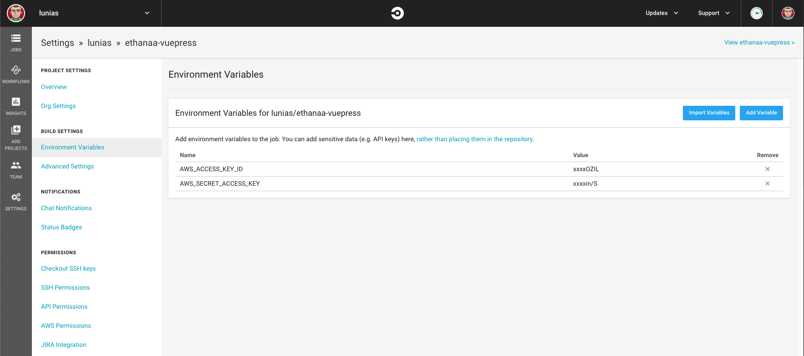

# January 9th, 2020

## Continuous Deployment with CircleCI and s3deploy

Now I have a simple to edit, static site that meets my résumé hosting and
blogging needs; but deployment is currently a bit tedious. Manually copying the
built files into the S3 bucket and invalidating the CloudFront distribution
takes too much time and requires too much fiddling with my mouse to encourage
consistent updates. :wink:

So, what am I after? I think a desirable workflow looks something like:

1. `yarn docs:dev`
2. Write a blog post
3. Commit and push the repository to [GitHub](https://github.com/lunias/ethanaa-vuepress)
4. `yarn docs:build` is run automatically
5. The output (`docs/.vuepress/dist/`) of the build is uploaded to AWS S3
6. The CloudFront distribution in front of the S3 bucket is invalidated

Steps 1, 2, and 3 are already doable; so what about 4, 5, and 6?

Sounds like a job for [CircleCI](https://circleci.com/)! CircleCI integrates
with our existing GitHub repository to provide a configurable build / deploy
pipeline as a service. It also offers a free plan which will work for us in this
case.

In order to perform the AWS operations of syncing the bucket and invalidating
the distribution, I've chosen to use the often recommended
[bep/s3deploy](https://github.com/bep/s3deploy) script. It's kind of like `aws
s3 sync`, but optimized for static sites to modify only the minimal set of
files.

Setting up CircleCI is as simple as making an account and using their interface
to set up a new project tracking our GitHub repository. Once that's complete, we
will need to create `.circleci/config.yml` in the root of the repository; but
before we get to editing it we need to satisfy a prerequisite first: creating a
deployment service account.

### AWS IAM User

First we need to create an IAM User in AWS that will represent the service
account under which s3deploy will do its work.

Add a user with the "Programmatic access" type. Click "Next: Permissions",
select "Attach existing policies directly", and then click on the "Create
policy" button.

The policy that I'm using looks like:

```json
{
    "Version": "2012-10-17",
    "Statement": [
        {
            "Effect": "Allow",
            "Action": [
                "s3:ListBucket",
                "s3:GetBucketLocation"
            ],
            "Resource": "arn:aws:s3:::www.ethanaa.com"
        },
        {
            "Effect": "Allow",
            "Action": [
                "s3:PutObject",
                "s3:DeleteObject",
                "s3:PutObjectAcl"
            ],
            "Resource": "arn:aws:s3:::www.ethanaa.com/*"
        },
        {
            "Effect": "Allow",
            "Action": [
                "cloudfront:GetDistribution",
                "cloudfront:CreateInvalidation"
            ],
            "Resource": "*"
        }
    ]
}
```

It allows s3deploy to fetch the information that it needs about the state of the
S3 bucket, insert / update / delete bucket contents, and invalidate our
CloudFront distribution (CDN cache) so that our changes are immediately
available.

**Make sure to download / copy the credentials for the new user to a file. We'll
need both the `AWS_ACCESS_KEY_ID` and the `AWS_SECRET_ACCESS_KEY` for the
configuration of our CircleCI project's build environment.**

### CircleCI

Set both `AWS_ACCESS_KEY_ID` and `AWS_SECRET_ACCESS_KEY` to the values
associated with the newly created deployment service account IAM User.



Now edit `.circleci/config.yml`:

<<< @/.circleci/config.yml

I've separated the config into 3 jobs: `install-dependencies`, `build`, and `deploy`.

First the dependencies are installed by running `yarn` as well as downloading
and extracting the latest release of s3deploy. Then `yarn docs:build` is run and
my résumé is copied from the root directory into `docs/.vuepress/dist/` so that
it's processed by s3deploy. Finally, s3deploy is executed targeting our S3
bucket and CloudFormation distribution.

If you push to any other branch than master then s3deploy will be run with
`-try`; resulting in a dry-run execution that will not modify any AWS objects.

So, let's commit the code and push it up to GitHub to trigger a build!

<ClientOnly>
  <Disqus shortname="ethanaa" />
</ClientOnly>
