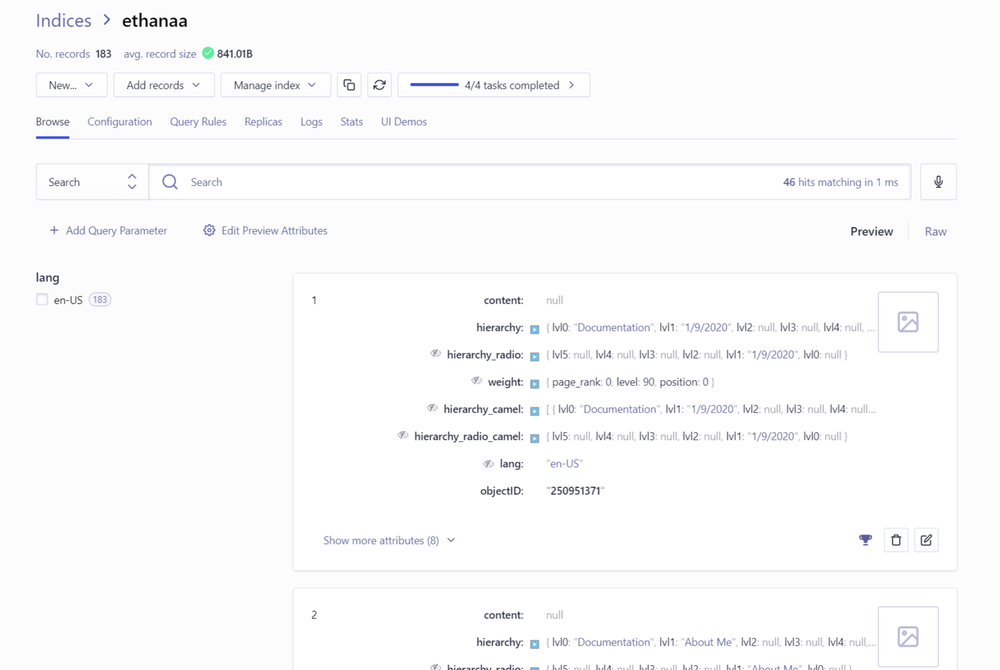

# January 9th, 2020

## Document Search with Algolia

[Algolia](https://www.algolia.com/) provides a simple to use, full-text search
API; that lucky for us, is supported by the default VuePress theme.

In order to integrate with that functionality we need to make an account with
Algolia and create an index. Then we need to copy our "Seach-Only API Key",
"Application ID", and chosen index name into our VuePress theme config.

### VuePress config.js
```javascript
themeConfig: {
  algolia: {
    apiKey: '692c04c8f1e443e098cfb2511ab8c99b',
    appId: '2SM2BJA0PV',
    indexName: 'ethanaa'
  }
}
```

Next we need to create a docsearch-scraper config that will instruct the Algolia
scraper on how to index our site.

### docsearch-scraper CONFIG
```json
{
  "index_name": "ethanaa",
  "start_urls": [
    "https://ethanaa.com/"
  ],
  "stop_urls": [],
  "selectors": {
    "lvl0": {
      "selector": "p.sidebar-heading.open",
      "global": true,
      "default_value": "Documentation"
    },
    "lvl1": ".theme-default-content h1",
    "lvl2": ".theme-default-content h2",
    "lvl3": ".theme-default-content h3",
    "lvl4": ".theme-default-content h4",
    "lvl5": ".theme-default-content h5",
    "text": ".theme-default-content p, .theme-default-content li",
    "lang": {
      "selector": "/html/@lang",
      "type": "xpath",
      "global": true,
      "default_value": "en-US"
    }
  },
  "strip_chars": " .,;:#",
  "custom_settings": {
    "attributesForFaceting": [
      "lang"
    ]
  }
}
```

Save the config to a file and then use `jq` to reduce it to a single line:

```bash
cat ethanaa.json | jq -r tostring
```

Create a `.env` file:

```bash
APPLICATION_ID=2SM2BJA0PV
API_KEY=${Admin API Key}
CONFIG={"index_name":"ethanaa","start_urls":["https://ethanaa.com/"],"stop_urls":[],"selectors":{"lvl0":{"selector":"p.sidebar-heading.open","global":true,"default_value":"Documentation"},"lvl1":".theme-default-content h1","lvl2":".theme-default-content h2","lvl3":".theme-default-content h3","lvl4":".theme-default-content h4","lvl5":".theme-default-content h5","text":".theme-default-content p, .theme-default-content li","lang":{"selector":"/html/@lang","type":"xpath","global":true,"default_value":"en-US"}},"strip_chars":" .,;:#","custom_settings":{"attributesForFaceting":["lang"]}}
```

Finally, run the docsearch-scraper docker image against your `.env` file:

```bash
docker run -it --env-file=.env algolia/docsearch-scraper
```

The site will then be scraped and the index updated in Algolia.

```bash
> DocSearch: https://ethanaa.com/ 111 records)
> DocSearch: https://ethanaa.com/blog/ 72 records)

Nb hits: 183
```



Give the search bar a try to see the results in action!
