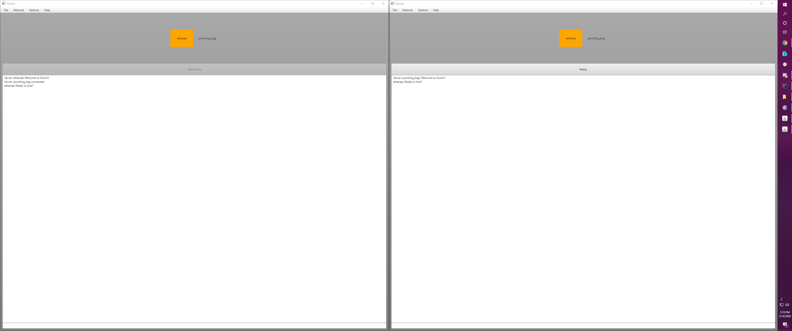

# July 14th, 2020

## Reviving old projects: Dominion with JavaFX

I was an early fan of the deck-building genre of card games, in particular
[Dominion](https://boardgamegeek.com/boardgame/36218/dominion). I spent many,
many hours playing games in person against my friends, but I always found it
tedious to tear down and set up new games. Various apps emerged to help you
randomize your supply piles, but you still needed to be very conscious of
keeping your collection well organized to cut down on the time required to find
each card. I did this for quite a while before I figured that I probably had the
skills to implement a digital version that would allow me to play way more games
in way less time.

I originally wrote this code back in 2012 or 2013 as a way to have fun while
leveling up my Java skillset. I began by implementing the base set and then
extending it over time to it's current state of containing 123 working cards;
including cards from Alchemy, Cornucopia, Dark Ages, Hinterlands, Intrigue,
Prosperity, and Seaside. Progress was quick in the beginning, but as the newer
sets began to introduce new mechanics; it became clear that my codebase was not
equipped to handle quite a few cards. I implemented everything that I could
without substantial refactoring. As the number of cards grew, the codebase grew
more and more unwieldy, until eventually I stopped working on it.

I had a lot of fun with this one. When I moved to Minnesota, my Arizona friends
and I played numerous games with this project. I couldn't have fixed all the
bugs without them :wink:.

You can check out the project [here](https://github.com/lunias/domin).

### UI

#### Host / Join

Upon running the game you're asked if you'd like to host or join an existing
game and provided inputs to provide the IP Address and port of the host or
simply the port you're hosting.

#### Waiting Room

The game supports up to 4 players so I created a waiting room where you can
chat. Once all players have "readied up" then the host is able to start the
game.

#### Victory

I implemented three different views for breaking down the score at the end of
the game.

- The first simply shows your score relative to the other players
- The second shows a table of which victory cards each player purchased
- The third shows a graph of each player's victory points at each turn during
  the game

### Networking

The networking in the game is implemented with sockets. The server creates a send
and receive thread for each client that is connected to it. Similarly, the
connected clients each create send and receive threads for talking to the
server. There are a variety of packets implemented that allow sending data to
and from the server, some of which instruct the server to broadcast the packet
to all connected clients.

This was my first attempted at a networked game. There were a lot of interesting
problems to solve, but it seems to work pretty well with no game breaking bugs
(that I know of).

There are no tests for this codebase. Everything was debugged by playing the
game - and no, I wouldn't take that approach in the future. It's time consuming
and easy to introduce bugs when implementing new mechanics.

<ClientOnly>
  <Disqus shortname="ethanaa" />
</ClientOnly>
