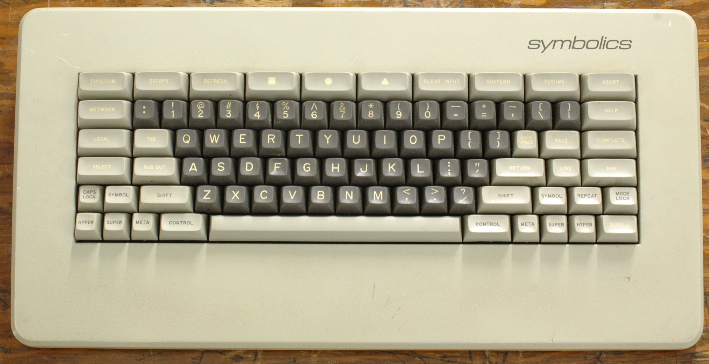
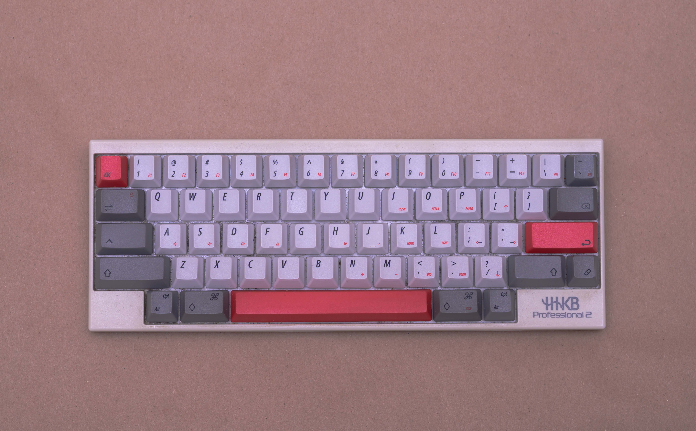
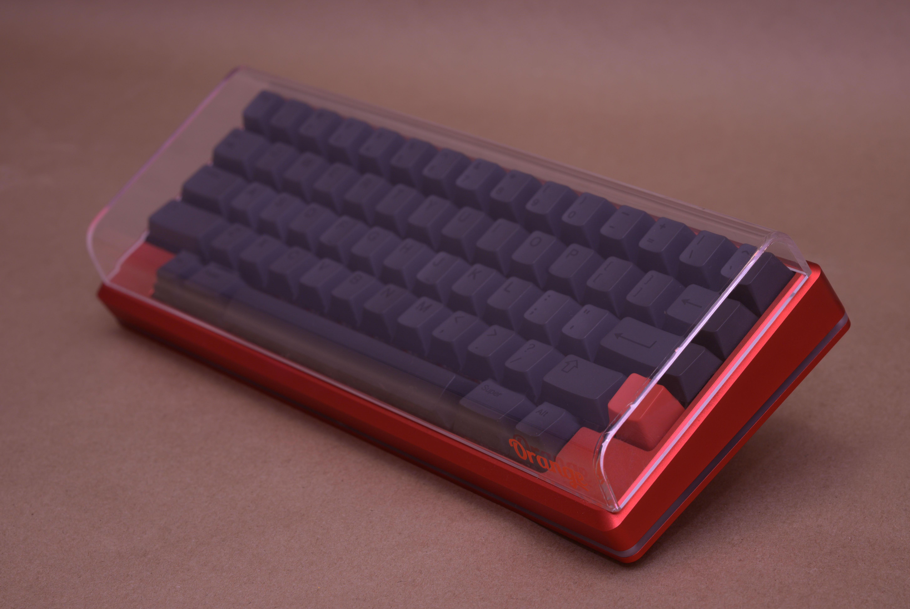
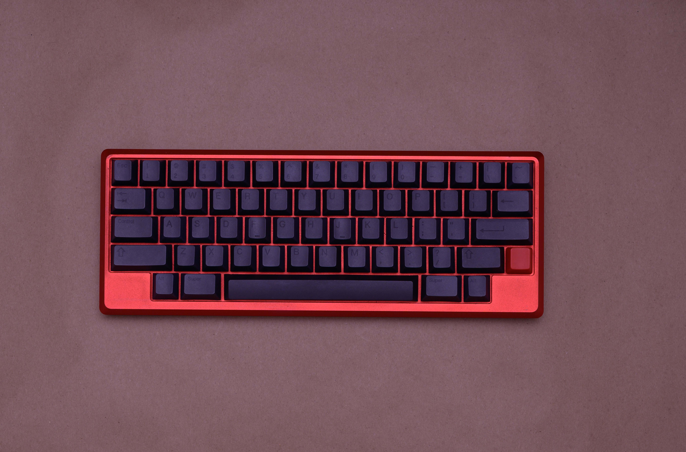
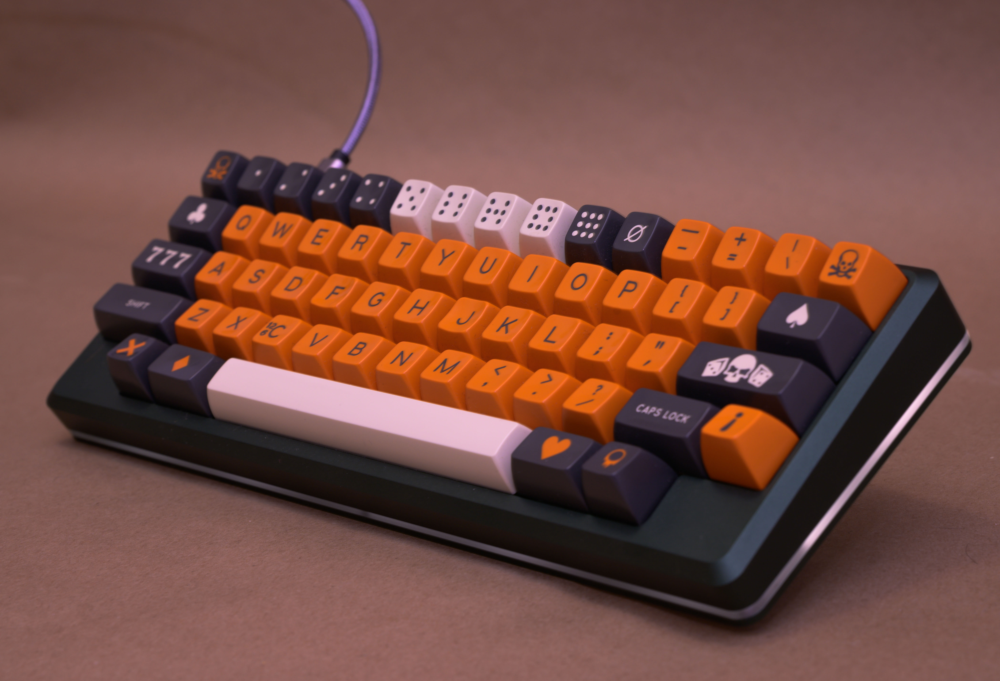
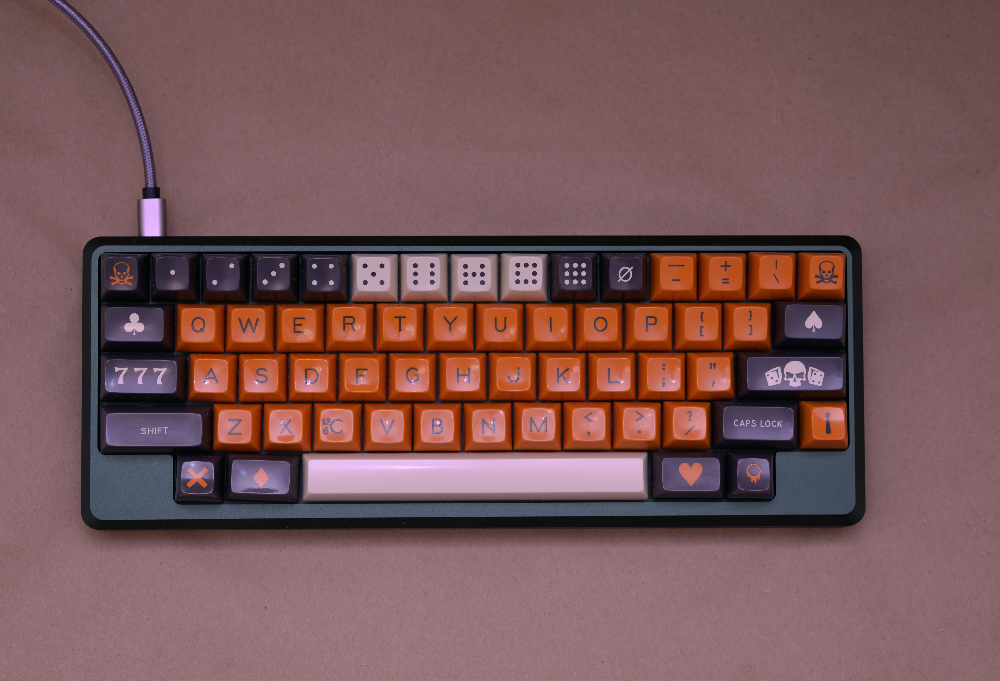
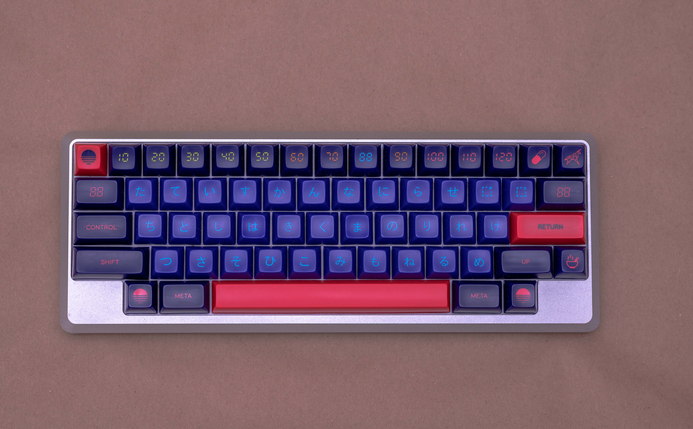

# February 11th, 2020

## Ode to The [Happy Hacking Keyboard (HHKB)](https://deskthority.net/wiki/HHKB_Professional2)

I bought a Happy Hacking Keyboard in college (10+ years ago now) and at $250 or
so, it was considerably out of my budget. I originally had my eye on a [Das
Keyboard](https://www.daskeyboard.com/) with [Cherry
Blue](https://deskthority.net/wiki/Cherry_MX_Blue) key switches, but the unit
that I was shipped suffered from a key transposition issue (which has since been
remedied in later revisions) forcing me to return it. After that I decided to
splash a bit more cash on what many considered an end-game keyboard at the time.
I do not regret it. I'm typing this article on that same HHKB and it still looks
and performs just like the day I bought it. Most craftsmen invest heavily in
their tools; why should programmers be any different?

### The Venerable Space-cadet

I use [Emacs](https://en.wikipedia.org/wiki/GNU_Emacs). For those unfamiliar,
it's a text editor / OS :wink: that was originally designed on / for the
[Symbolics Space-cadet](https://en.wikipedia.org/wiki/Space-cadet_keyboard)
keyboard [1979].

The Space-cadet had more modifiers than most keyboards of its era or any other. And
Emacs makes use of these extensively; especially CTRL and META. SUPER and HYPER
are used to a much lesser extent. On a standard US QWERTY board the CTRL key is
in a position that leads to it being pressed primarily by an awkwardly contorted
pinky finger, potentially causing an uncomfortable condition dubbed [Emacs
pinky](https://en.wikipedia.org/wiki/Emacs#Emacs_pinky). This has prompted many
Emacs users to remap their keyboards to reduce the chance of repetitive stress
injuries.

[QMK firmware](https://docs.qmk.fm) even has a feature [named after the
Space-cadet](https://beta.docs.qmk.fm/features/feature_space_cadet). Which
causes the modifiers (shift and alt) to act as a modifier when long-pressed, but
type a parenthesis / square bracket / bracket when quick-pressed alone or in
combination. Although it appears to simply be an [optimization made by Steve
Losh](https://stevelosh.com/blog/2012/10/a-modern-space-cadet/#s17-shift-parentheses)
when attempting to recreate a modern Space-cadet, it's not any less useful. I've
enabled it on all of my Tokyo60s.

:::quote Shift Parentheses
Occasionally I'll accidentally type a parenthesis when meaning to do
something else, but it happens so infrequently and the benefits are so great
that I'd absolutely recommend this to anyone who programs a lot.
::: right
From Steve Losh in [A Modern Space Cadet](https://stevelosh.com/blog/2012/10/a-modern-space-cadet/#s17-shift-parentheses)
:::

The Space-cadet was succeeded by the simpler, but still specialized (and very
cool!) [Symbolics
Keyboard](https://en.wikipedia.org/wiki/Symbolics#Symbolics_keyboard) in 1983.
Note that the CONTROL key is still placed next to the (very long) spacebar and
CAPS LOCK is 1u and even looks to be recessed :laughing:.

### Back Down to Earth 

I was interning at IBM when I found a prime example [IBM Model
M](https://en.wikipedia.org/wiki/Model_M_keyboard) (my first mechanical
keyboard) abandoned in a lab that I made into my daily-driver during the time I
worked there, but I've never come across anything as exotic as either of those
two legendary Symbolics boards. In order to avoid RSI on a standard QWERTY, I
would swap CAPS LOCK and CTRL in software, but this isn't a great solution
because it's not portable. If you're working on a new machine, then you need to
do tedious OS-specific configuration in order to get back to a productive state.
The HHKB layout takes this common desire of Emacs users into account by placing
CTRL right on the home row (where it belongs :stuck_out_tongue_winking_eye:). Of
course over the years muscle memory has set in and now I feel compelled to bring
a keyboard with this unique layout with me whenever I have real work to do.

*This* is my favorite layout. The HHKB layout; most similar to the [Sun Type
3](https://deskthority.net/wiki/Sun_Type_3) keyboard.

:::quote Common features
- The control key is found where most keyboards place the caps lock. This is the
  only control key on the keyboard.
- The esc key is located to the left of the 1 key; the tilde key normally found
  there is at the right end of the same row.
- The delete key is located directly above the enter key; the key normally found
  there is the second-rightmost key on the row above it. Furthermore, this is an
  actual delete key, not a historically named backspace. Backspace is accessible
  through Fn+Delete though its function can be interchanged with the backspace
  key using a DIP switch, using this setting, the delete key is accessed via
  Fn+`
- The meta keys are located between the space bar and the alt keys.
:::right
From [Wikipedia: Happy Hacking Keyboard](https://en.wikipedia.org/wiki/Happy_Hacking_Keyboard)
:::

If you haven't used a 60% layout before and can live without dedicated arrow
keys / a numpad then I highly recommend it. I find that the smaller form-factor
allows your mouse to sit in a much more ergonomic position on your desk.

### My HHKB Pro 2

#### Switches

45g [Topre](https://deskthority.net/wiki/Topre_switch)

Topre are not mechanical key switches in the traditional sense. They're
electrostatic capacitive and unique amongst Cherry MX and derived switches.
They're extremely satisfying switches. They have a distinctly soft *thonk*. The
issue with Topre switches is the availablity of key caps. As most key caps are
Cherry MX compatible you're limited in your styling potential.

#### Key Caps

[EC HHKB D&G REV2 DYE SUB KEYCAPS](https://kbdfans.com/products/ec-hhkb-d-g-rev2-dye-sub-keycaps) [Dye Sub PBT]

#### Extras

[HHKB HG Embossed Vibration Absorption Mat](http://www.smartimports.net/hhkb-hg-embossed-vibration-absorption-mat/)

[HHKB Keyboard Roof](http://www.smartimports.net/happy-hacking-keyboard-professional-keyboard-roof-clear/)

## My [Tokyo60 V2](https://drop.com/buy/massdrop-x-tokyo-keyboard-tokyo60-keyboard-kit)

:::quote DESCRIPTION
The Tokyo60 is a compact hhkb-style board with a sleek, seamless design.
Constructed with two pieces of 6000-series aluminum, the case is machined at a
5-degree angle. This angle, combined with the cherry-profile keycaps, is
optimized for an ergonomic feel. Built into the aluminum case, the integrated
plate adds even more stability. Thanks to the hot-swap sockets on the pcb, you
can swap in new switches in minutes without any soldering—so feel free to try a
new feel whenever you want. With a fully programmable layout and rgb lighting,
the board can be customized any way you like.
:::right 
From [Tokyo Keyboard Club: Tokyo60](https://tokyokeyboard.com/tokyo60/)
:::

To me this sounds like the perfect modern equivalent of the HHKB; so I picked one up.

*The Tokyo60s are programmable and I've customized mine. I provided some info on
[my QMK Configuration](/blog/qmk-firmware-customization/#custom-configuration)
in a previous post.*

### Akira Red

#### Switches

65g [Zeal PC Zealios](https://zealpc.net/products/zealio)

These switches are better [Cherry
Browns](https://deskthority.net/wiki/Cherry_MX_Brown). Tactile with a good
weight. Slightly heavier, but that's my preference.

#### Key Caps

[MT3 Susuwatari](https://drop.com/buy/massdrop-x-matt3o-mt3-susuwatari-custom-keycap-set) [Doubleshot ABS] *coming soon*

#### Extras

[Orange Acrylic Anti-Dust Keyboard Cover](https://kprepublic.com/products/acrylic-ornage-60-dust-cover-anti-dust-guard-cap-for-60-mechanical-keyboard-such-as-gh60-satan60-xd60-xd64-infinity-60-poker-2)

## My [Tokyo60 V3](https://drop.com/buy/massdrop-x-tokyo-keyboard-tokyo60-keyboard-kit)s

I liked it so much I bought it twice. Plus I needed some more real-estate to support my key cap addiction.

It's disapointing to note that [Drop (formerly
Massdrop)](http://www.massdrama.com/) messed this one up pretty seriously. The
boards were shipped without a working bootloader and many came without an HHKB
layout mapped. Without a bootloader there is no way to flash the firmware and
customize your keymap or enable any additional features provided by QMK. To add
insult to injury, the provided screws were not long enough to secure the
case-back with the acrylic diffuser in place.

Luckily the community came through with a
[solution](https://github.com/davidfriar/tokyo60ispflashing/blob/master/README.md)
for the bootloader that [I employed to great
success](/blog/qmk-firmware-customization/#isp-flashing). The screws were
easily replaced with a trip to the hardware store. 3mm x 10mm metric phillips
flat machine screws did the trick.

### Gyoen Green

#### Switches

60g [NovelKeys x Kailh BOX Navy](https://novelkeys.xyz/products/novelkeys-x-kailh-box-thick-clicks)

These switches are pretty unique in their usage of a thick click bar. They're
not at all [IBM buckling
springs](https://deskthority.net/wiki/IBM_buckling_spring), but they're probably
the closest analogue at the time of writing. They're pretty loud, but by far the
most tactile switches that I own. 60g feels heavy on these. In a nice way.

#### Key Caps

[SA Carbon](https://drop.com/buy/carbon) [Doubleshot ABS]

#### Extras

[Orange Acrylic Anti-Dust Keyboard Cover](https://kprepublic.com/products/acrylic-ornage-60-dust-cover-anti-dust-guard-cap-for-60-mechanical-keyboard-such-as-gh60-satan60-xd60-xd64-infinity-60-poker-2)

### Silver

#### Switches

100g [Aliaz](https://novelkeys.xyz/products/aliaz-switches) / 67g [Zeal PC Healios](https://zealpc.net/products/healios)

Originally I ordered Aliaz 100g switches for this board, but since using them I
think that I'd prefer something with a lower actuation force. They're very
smooth and quiet switches - not at all mushy, but due to the weight and limited
tactility I occasionally miss a keystroke. A 100g switch is certainly unique,
but I plan on replacing them with 67g Healios switches.

#### Key Caps

[SA Laser](https://drop.com/buy/drop-mito-sa-laser-custom-keycap-set) [Doubleshot ABS]

#### Extras

[Orange Acrylic Anti-Dust Keyboard Cover](https://kprepublic.com/products/acrylic-ornage-60-dust-cover-anti-dust-guard-cap-for-60-mechanical-keyboard-such-as-gh60-satan60-xd60-xd64-infinity-60-poker-2)

## What's next?

[RAMA WORKS M60-A](https://rama.works/m60-a) Oooh I wanna pre-order one now.

<ClientOnly>
  <Disqus shortname="ethanaa" />
</ClientOnly>
