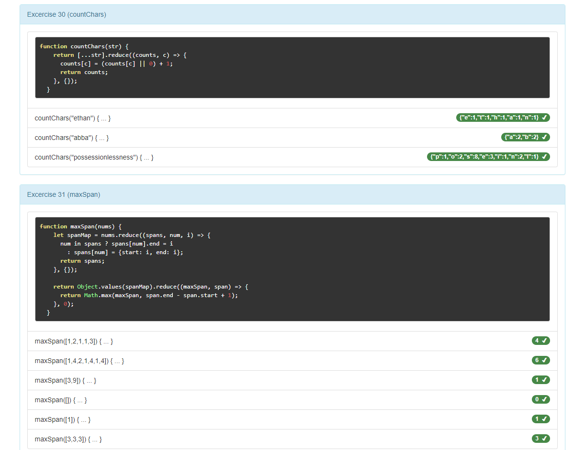

# July 14th, 2020

## Reviving old projects: [CodingBat](https://codingbat.com/java) in JavaScript

Back in 2017 I was looking to brush up on my JavaScript so that I could become
more effective working on the front-end. Back when I was first learning Java I
did all of the [CodingBat](https://codingbat.com/java) exercises and found that
it really helped me get a good grasp of the basics; so I [wrote a simple
framework](https://github.com/lunias/js-codingbat) for working on CodingBat
exercises in JavaScript.

The goal was to create a simple front-end for validating my answers. I could
have written unit tests, but this approach presented a unique challenge of
developing an ultra-light framework for producing visually pleasing results - and
I'm able to easily share it here within the context of a static site.

See a [Live Demo here](/js-codingbat-static)

I think it's a great idea to do something like this whenever you set out to
learn a new language. CodingBat provides some basic and challenging exercises
without entering into the math-heavy realm of [Project
Euler](https://projecteuler.net/).

<ClientOnly>
  <Disqus shortname="ethanaa" />
</ClientOnly>
