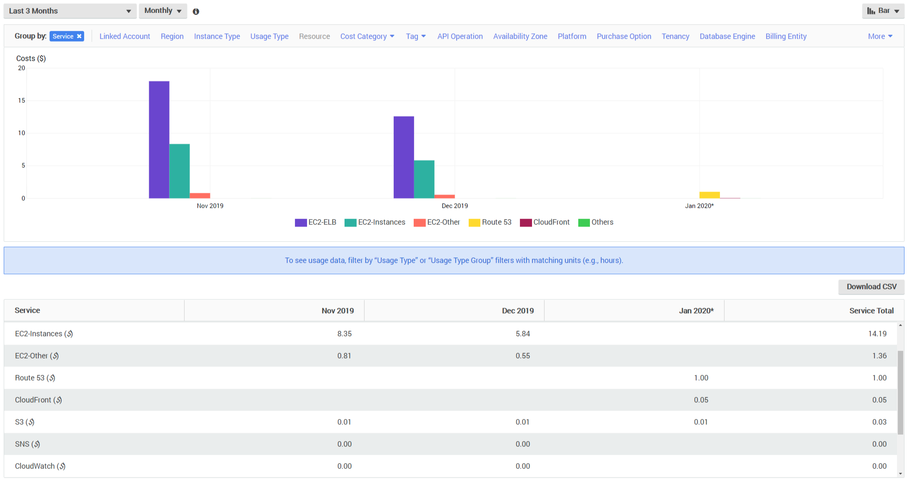
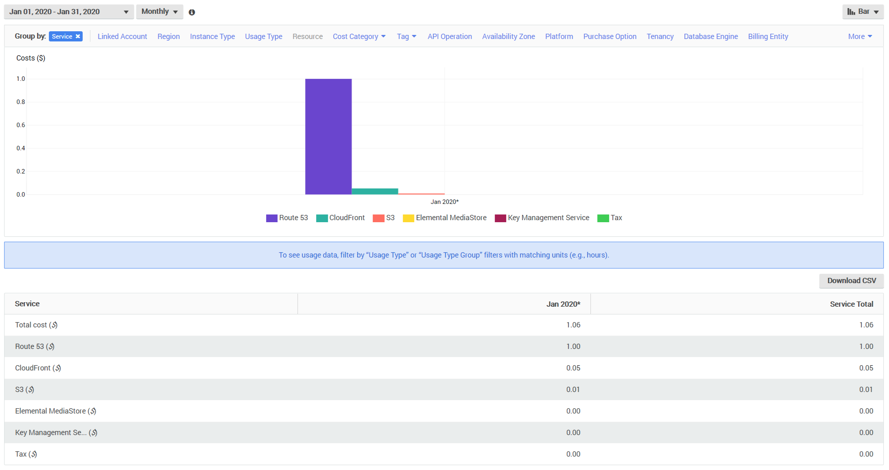

# February 1st, 2020

## Cost Summary

In my first post on this site I documented the reasons why I had decided to
reimplement ethanaa.com in a static fashion. It's been about a month since then
and I promised some updates on what it's really costing me compared to my
initial estimate of $1-3/month.

### Costs Per Month

That's quite a huge percent reduction in my operating costs for January. **From
$25 or so per month down to $1.06.**

### January Cost Report

Yup. $1.06. Seems like the initial estimate holds, but it will be interesting to
see how the monthly costs fluctuate over time.

### Audience Report

There are not currently a lot of users accessing my site; costs this low are not
to be expected with a much more popular site, although I would expect them to be
very reasonable. I'm personally very happy with the results of hosting my
website [this way](/blog/conversion-to-static-site-with-vuepress-and-aws-s3).

<ClientOnly>
  <Disqus shortname="ethanaa" />
</ClientOnly>
