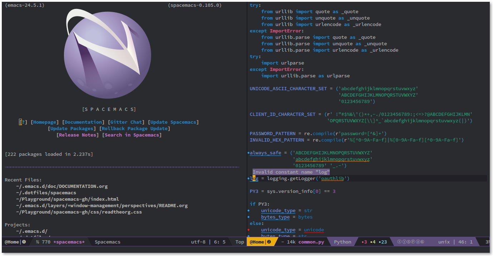
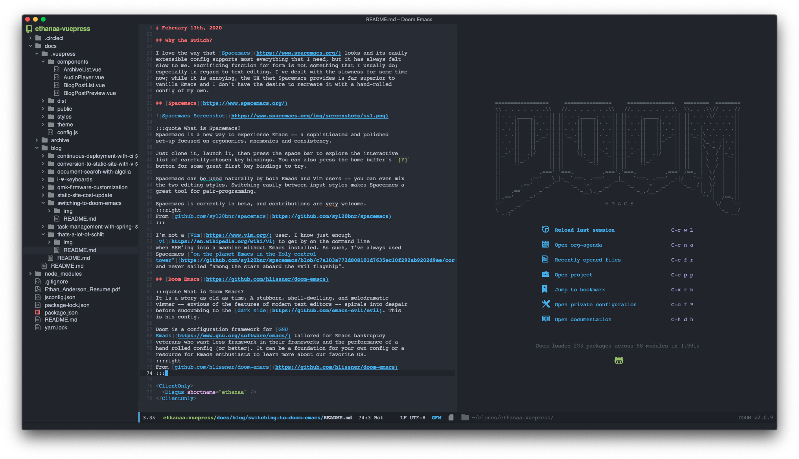
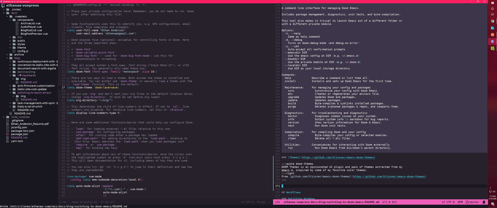

# February 13th, 2020

## Why the Switch?

I love the way that [Spacemacs](https://www.spacemacs.org/) looks and its easily
extensible config supports most everything that I need, but it has always felt
slow to me. Sacrificing function for form is not something that I usually do;
especially in regard to text editing. I've dealt with the slowness for some time
now; while it is annoying, the UX that Spacemacs provides is far superior to
vanilla Emacs and I don't have the desire to recreate it with a hand-rolled
config of my own.

## [Spacemacs](https://www.spacemacs.org/)



:::quote What is Spacemacs?
Spacemacs is a new way to experience Emacs -- a sophisticated and polished
set-up focused on ergonomics, mnemonics and consistency.

Just clone it, launch it, then press the space bar to explore the interactive
list of carefully-chosen key bindings. You can also press the home buffer's `[?]`
button for some great first key bindings to try.

Spacemacs can be used naturally by both Emacs and Vim users -- you can even mix
the two editing styles. Switching easily between input styles makes Spacemacs a
great tool for pair-programming.

Spacemacs is currently in beta, and contributions are very welcome.
:::right
From [github.com/syl20bnr/spacemacs](https://github.com/syl20bnr/spacemacs) 
:::

I'm not a [Vim](https://www.vim.org/) user. I know just enough
[vi](https://en.wikipedia.org/wiki/Vi) to get by on the command line
when SSH'ing into a machine without Emacs installed. As such, I've always used
Spacemacs ["on the planet Emacs in the Holy control
tower"](https://github.com/syl20bnr/spacemacs/blob/c7a103a772d808101d7635ec10f292ab9202d9ee/core/core-dotspacemacs.el)
and never sailed "among the stars aboard the Evil flagship".

Spacemacs contends, "The best editor is neither Emacs nor Vim, it's Emacs *and*
Vim!".

## [Doom Emacs](https://github.com/hlissner/doom-emacs)



:::quote What is Doom Emacs?
It is a story as old as time. A stubborn, shell-dwelling, and melodramatic
vimmer -- envious of the features of modern text editors -- spirals into despair
before succumbing to the [dark side](https://github.com/emacs-evil/evil). This
is his config.

Doom is a configuration framework for [GNU
Emacs](https://www.gnu.org/software/emacs/) tailored for Emacs bankruptcy
veterans who want less framework in their frameworks and the performance of a
hand rolled config (or better). It can be a foundation for your own config or a
resource for Emacs enthusiasts to learn more about our favorite OS.
:::right 
From [github.com/hlissner/doom-emacs](https://github.com/hlissner/doom-emacs)
:::

Much like Spacemacs, Doom Emacs defaults to using the extensible vi layer
([EVIL](https://github.com/emacs-evil/evil)) mode. It certainly seems like most
people prefer the vi key bindings, but still want that one-stop-shop experience
that Emacs provides so well.

Doom Emacs has a similar interface to Spacemacs, but based on my limited usage
thus far; seems much more polished. For one, it starts up in under 2 seconds on
my work MacBook Pro. You may be yelling in your chair right now: "You don't run
Emacs over and over! You use the client/server! Who cares if it takes time to
start when you're only going to start it once?" 

I do use the client / server, but I'm not so lucky to have an always-on
workstation at work. It's also more responsive in general when browsing for
files or performing searches.

`alias ec="emacsclient -n -a emacs"`

## [Installing on macOS Mojave (10.14.5)](https://github.com/hlissner/doom-emacs/blob/develop/docs/getting_started.org#on-macos)

### Install Dependencies

``` sh
# required dependencies
brew install git ripgrep
# optional dependencies
brew install coreutils fd
# Installs clang
xcode-select --install
```

### Install Emacs

``` sh
brew tap d12frosted/emacs-plus
brew install emacs-plus
ln -s /usr/local/opt/emacs-plus/Emacs.app /Applications/Emacs.app
```

### Install Doom

``` sh
git clone https://github.com/hlissner/doom-emacs ~/.emacs.d
~/.emacs.d/bin/doom install
```

## [Installing on Windows 10](https://github.com/hlissner/doom-emacs/blob/develop/docs/getting_started.org#on-windows)

### Activate WSL and Install Ubuntu 18.04 LTS

1. In Powershell as admin (Windows key + x) run:
``` powershell
Enable-WindowsOptionalFeature -Online -FeatureName Microsoft-Windows-Subsystem-Linux
```
2. Restart
3. Download and install Ubuntu 18.04 LTS from the Microsoft Store
4. Launch Ubuntu 18.04 LTS
5. Update and upgrade Ubuntu
``` sh
sudo apt update && sudo apt upgrade
```

### Install Doom Emacs

1. Install Emacs 26
``` sh
sudo add-apt-repository ppa:kelleyk/emacs
sudo apt update
sudo apt install emacs26
```
2. Install Doom Emacs
``` sh
git clone https://github.com/hlissner/doom-emacs ~/.emacs.d
~/.emacs.d/bin/doom install
```
3. [Configure Doom](/blog/switching-to-doom-emacs/#configuring-doom)
``` sh
~/.emacs.d/bin/doom refresh
~/.emacs.d/bin/doom sync
```
4. Run Doom Doctor
``` sh
~/.emacs.d/bin/doom doctor
```

### Install a Windows X Server

- [Xming X Server for Windows](https://sourceforge.net/projects/xming/)
- [VcXsrv Windows X Server](https://sourceforge.net/projects/vcxsrv/)

### Create an Alias to Launch Emacs

``` sh
alias emax='
export DISPLAY=:0.0
export LIBGL_ALWAYS_INDIRECT=1
setxkbmap -layout us
setsid emacs
exit
'
```

In order to run Emacs: open Ubuntu 18.04 LTS in Windows and run `emax` in the
terminal. The terminal will exit and Doom should launch in an X window.

The local Windows filesystem is available under `/mnt`.

Run with the usual `emacs -nw` for no X window.

## Configuring Doom

Inside `~/.doom.d/`:

- `config.el`

Place your private configuration here! Remember, you do not need to run `doom
refresh` after modifying this file!

- `init.el`

This file controls what Doom modules are enabled and what order they load in.
Remember to run `doom sync` after modifying it!

- `packages.el`

This is where you install packages, by declaring them with the `package!` macro,
then running `doom refresh` on the command line. You'll need to restart Emacs
for your changes to take effect! Or at least, run `M-x doom/reload`.

You'll find the `doom` binary in the `~/.emacs.d/bin` directory:

``` sh
➜  bin (develop) ✔ ./doom help
Usage: doom [-hdy] [COMMAND]

A command line interface for managing Doom Emacs.

Includes package management, diagnostics, unit tests, and byte-compilation.

This tool also makes it trivial to launch Emacs out of a different folder or
with a different private module.

Options:
  -h, --help
    Same as help command
  -d, --debug
    Turns on doom-debug-mode (and debug-on-error)
  -y, --yes
    Auto-accept all confirmation prompts
  --emacsdir DIR
    Use the emacs config at DIR (e.g. ~/.emacs.d)
  --doomdir DIR
    Use the private module at DIR (e.g. ~/.doom.d)
  --localdir DIR
    Use DIR as your local storage directory

Commands:
  help             Describe a command or list them all.
  install          Installs and sets up Doom Emacs for the first time.

  Maintenance:     For managing your config and packages
    sync             Synchronize your config with Doom Emacs.
    env              Creates or regenerates your envvars file.
    upgrade          Updates Doom and packages.
    update           Updates packages.
    build            Byte-compiles & symlinks installed packages.
    purge            Deletes orphaned packages & repos, and compacts them.

  Diagnostics:     For troubleshooting and diagnostics
    doctor           Diagnoses common issues on your system.
    info             Output system info in markdown for bug reports.
    version          Show version information for Doom & Emacs.
    test             Run Doom unit tests.

  Compilation:     For compiling Doom and your config
    compile          Byte-compiles your config or selected modules.
    clean            Delete all *.elc files.

  Utilities:       Conveniences for interacting with Doom externally
    run              Run Doom Emacs from bin/doom's parent directory.
```

### [Themes](https://github.com/hlissner/emacs-doom-themes)

:::quote doom-themes
DOOM Themes is an opinionated UI plugin and pack of themes extracted from my
emacs.d, inspired by some of my favorite color themes.
:::right
From [github.com/hlissner/emacs-doom-themes](https://github.com/hlissner/emacs-doom-themes)
:::

#### Doom Laserwave


## Workflows

### Splitting Windows

I use this *a lot*. I wish every application supported splitting the window like
Emacs (If anyone knows a web browser that supports this I'd like to know - I do know about and use [TWMs](https://en.wikipedia.org/wiki/Tiling_window_manager) when I can).

`C-x 2` [`split-window-below`] - Splits the window horizontally.

`C-x 3` [`split-window-right`] - Splits the window vertically.

#### Un-splitting Windows

`C-x 0` [`+workspace/close-window-or-workspace`] - Close the selected window. If
it's the last window in the workspace, either close the workspace (as well as
its associated frame, if one exists) and move to the next.

`C-x 1` [`delete-other-windows`] - Make the selected window fill its frame.

### Jumping Between Windows

Doom suprised me with this one. The keybinding is the same as the Emacs default,
but it uses `ace-window` instead of `other-window`. It's great though. Just
follow up with the highlighted character in the top left of the buffer to switch
to that window.

`C-x o` [`ace-window`] - Select a window.

### Search For Other Occurrences in Buffer

`C-s C-w` [`isearch-forward`] - Do incremental search forward 

(keep holding Ctrl and pressing `w` until all words you intend to search for have
been selected and then go back to pressing `s` to search).

`C-c s S` [`swiper-isearch-thing-at-point`] - Insert symbol-at-point into the
minibuffer of swiper-isearch.

### Search Project

`C-c s p` [`+default/search-project`] - Conduct a text search in the current
project root

*I'd also like to be able to search the entire project for the word at point,
but I'm not sure if Doom supports this out of the box.*

### Open Project File Explorer

`C-c o p` [`+treemacs/toggle`] - Initialize or toggle treemacs. 

### Open a Terminal

`C-c o t` [`+term/toggle`] - Toggle a persistent terminal popup window.

### Text Manipulation

`M-q` [`fill-paragraph`] - Fill paragraph at or after point.

Introduces line breaks into text to keep columns as close to 80 characters as
possible.

### Help

`C-h k` [`helpful-key`] - Show help for interactive command bound to
KEY-SEQUENCE.

`C-h v` [`counsel-describe-variable`] - Display the full documentation of VARIABLE (a symbol). 

`C-h f` [`counsel-describe-function`] - Display the full documentation of FUNCTION (a symbol). 

<ClientOnly>
  <Disqus shortname="ethanaa" />
</ClientOnly>
