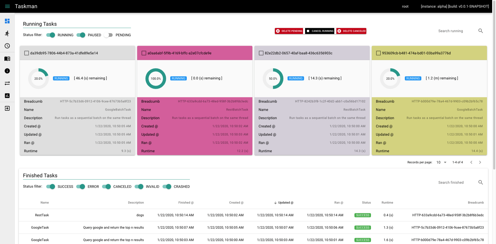
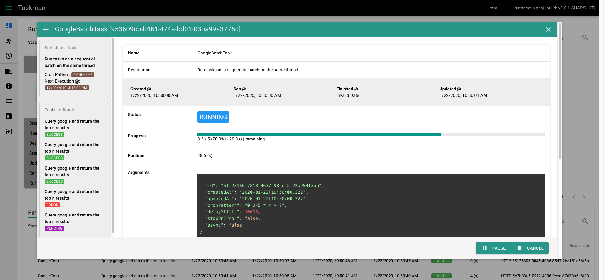
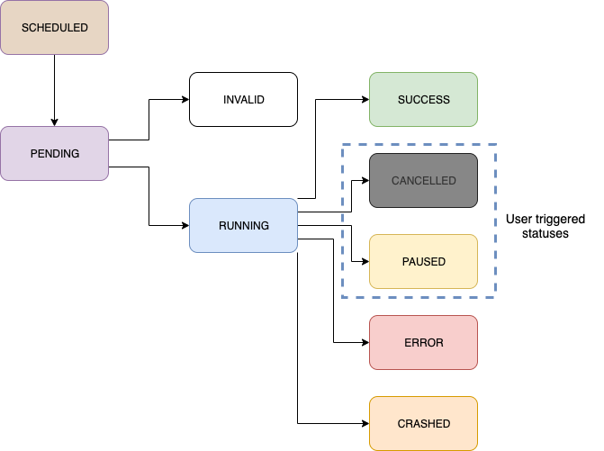
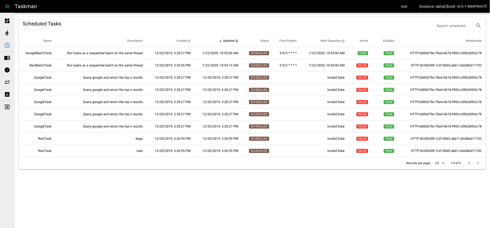
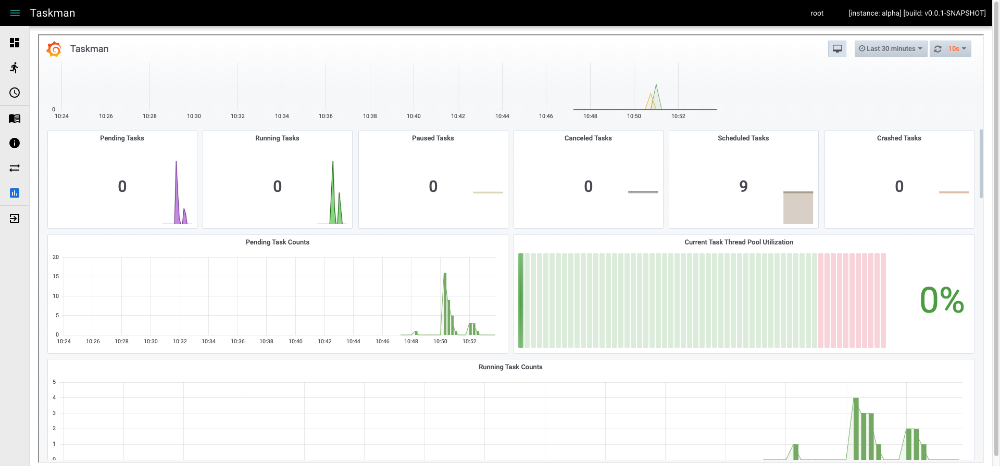
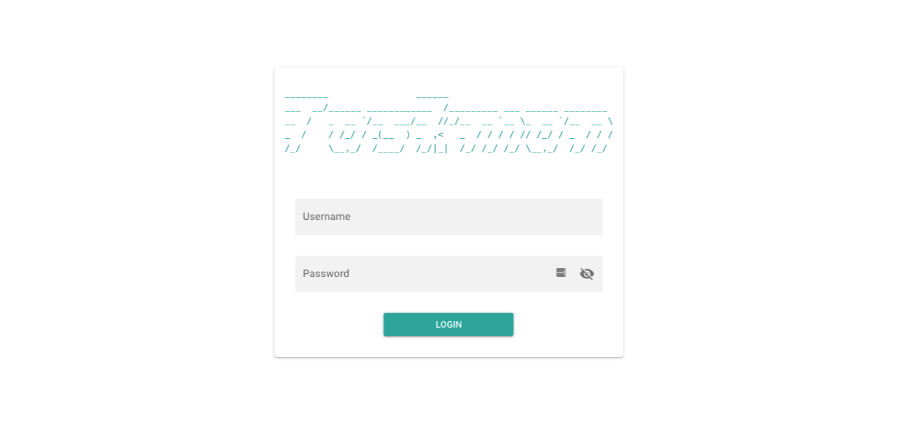

# January 22nd, 2020

*Taskman currently resides in a private GitHub repository, but I wanted to
share a bit about what it's capable of. This post is largely taken from
Taskman's `README.md`.*

## Taskman Summary



Taskman is a platform for running tasks; including functionality for monitoring their status, progress, and results.

There are two primary task abstractions:

1. `Task`

   Tasks are essentially functions with metadata attached. They accept `TaskArgs` (arguments) and produce a `TaskResult` (a result).
      
   Task arguments and results are highly dependent on the intent of the task itself. At a minimum they provide:
      
   `TaskArgs`:

       [String] description - a description of the task
       [String] bearerToken - authorized JWT token at time of task submission 
       [String] cronPattern - quartz cron expression describing the interval at which this task is to run
    
   `TaskResult`:

       [String] exception - the stacktrace if this task threw an exception
       
   Everything else required should reside in an implementation of `Task`, `TaskArgs`, or `TaskResult`.
           
2. `BatchTask`

   BatchTasks are essentially a list of `Task`s to be executed sequentially on the same thread or asynchronously on separate threads 
   (potentially separate instances of `taskman-backend` entirely). They accept `BatchTaskArgs` (`TaskArgs++`) and produce a `BatchTaskResult` (`TaskResult++`).
      
   `BatchTaskArgs` and `BatchTaskResult` both inherit from `TaskArgs` and `TaskResult` respectively. In addition to their parent classes' fields they also possess:

   `BatchTaskArgs`:

       [long]    delayMillis - how long the executing thread should sleep inbetween child task executions in milliseconds
       [boolean] stopOnError - whether or not the batch task should terminate in the event of a child task error (only applicable to non-async batches)
       [boolean] isAsync     - whether or not to execute each child task on the same thread as the batch task or spawn a new thread per task
    
   `BatchTaskResult`:

       [int]               totalTasks     - the total number of tasks in the batch
       [int]               currentTask    - the task number that the batch task is currently executing
       [int]               canceledOnTask - the task number that the batch task was canceled on
       [List<UUID>]        errors         - a list of ids for tasks which terminated in error
       [List<UUID>]        successes      - a list of ids for tasks which completed successfully
       [List<UUID>]        paused         - a list of ids for tasks which are currently paused       
       [Map<UUID, String>] exceptions     - a map of ids to stacktraces (for tasks which threw exceptions)



#### Task Statuses



- Statuses considered complete
  - `SUCCESS`
  
    Indicates that the task was successful. Successful tasks can be rerun or deleted.
    
  - `ERROR`
  
    Indicates that the task encountered an unrecoverable error. Tasks in error can be rerun or deleted.
  
  - `CANCELED`
  
    Indicates that task execution was canceled manually. Canceled task can be rerun or deleted.
  
  - `INVALID`
  
    Indicates that the task could not execute due to its arguments failing validation. Invalid tasks can be deleted.
  
  - `CRASHED`
  
    Indicates that the thread executing the task crashed before normal completion. 
    Crashed tasks can be resumed, rerun, or deleted.
  
- Other statuses
  - `SCHEDULED`
  
    Scheduled tasks are templates created when a task is submitted with a `cronPattern` argument. 
    The scheduled template is copied and submitted for execution when its cron triggers. 
  
  - `PENDING`
  
    Indicates that the task is waiting for an available thread on which to run. 
    Pending tasks can be paused or canceled.
  
  - `RUNNING`
  
    Indicates that the task is currently running on a thread. Running tasks can be paused or canceled.
  
  - `PAUSED`
  
    Indicates that task execution will be paused as soon as the task acknowledges its paused status. 
    Paused tasks can be resumed, or canceled.

### Scheduling



Any `Task` or `BatchTask` can be scheduled to run according to a [Quartz](http://www.quartz-scheduler.org/documentation/quartz-2.3.0/tutorials/crontrigger.html) cron expression
(*This format is slightly different than traditional Cron, so I recommend looking at the documentation*).

Scheduled tasks are automatically loaded and scheduled upon application start.

Scheduled tasks will not be run if they are already running. In the event that an application error results in a 
scheduled task which is erroneously active, it can be deactivated via the UI. Deactivation will ensure that the task is
run at its next scheduled interval.

When a task is scheduled, a message is sent to all instances; informing them to follow suit and schedule that task.
This ensures, should the initial instance go offline, that the task is still run according to its schedule.

Scheduled tasks can be disabled if execution is to be temporarily disabled. Currently, if a scheduled task is deleted
then all tasks run according to that schedule will also be deleted.

### Task Reaper

When Taskman starts, it schedules a task reaper thread to run every `5` minutes. Any running task which has not been updated in the last
`5` minutes will be transitioned to a crashed status when the task reaper runs. Crashed tasks can occur if a `taskman-backend` instance
currently running task(s) is shutdown or terminates irregularly. Crashed tasks can be resumed or reran via the UI.

### Scaling

Taskman has been designed with horizontal scaling in mind. It uses [RabbitMQ](https://www.rabbitmq.com/) as a message broker in order to
distribute tasks across instances. All task state is stored in the `taskman` application database and concurrent writes / reads to
shared resources are controlled via database locks.

Time spent waiting on a database lock is expected to be nearly zero unless the executing `BatchTask` contains many asynchronous `Task`s
with near-equal runtimes.

Vertical scale is a function of how many executor threads a `taskman-backend` instance is configured to use.
The application property, `taskman.executorThreads`, represents the total number of tasks that can execute concurrently on
the instance. If all instances are at capacity at the time of task execution, then the task message is delayed `taskman.noThreadsMessageDelaySeconds` seconds before
being republished to the task exchange.

### Metrics and Monitoring



*Spring Boot Admin works well for high level application metrics (non-persistent), logging configuration, et cetera; but Prometheus and Grafana provide*
*a much more extensive platform for dashboarding arbitrary task metrics and aggregating data across instances.*

Spring Boot auto-configures [Micrometer](https://micrometer.io/), an application metrics façade that supports 
numerous monitoring systems.

Taskman uses [Prometheus](https://prometheus.io/) and [Grafana](https://grafana.com/) in order to provide a customizable 
suite of monitoring dashboards. These dashboards, as well as their data, are persistent.

A Prometheus datasource is provisioned automatically; it can be configured by editing 
`/taskman/backend/grafana/provisioning/datasources/all.yml`. 

Dashboards can be created / edited via the Grafana web interface, exported to json, and put in 
`taskman/backend/grafana/dashboards`. Dashboards found in this directory will be automatically provisioned.

There are currently 3 dashboards provided:

- `Taskman`

Custom application metrics implemented specifically for Taskman

- `Taskman Actuator`

Metrics exposed by Spring Boot Actuator

- `RabbitMQ`

[RabbitMQ metrics](https://www.rabbitmq.com/prometheus.html) sent directly to Prometheus

### Logging and Traceability

Task execution is easily traceable across threads / instances because each log statement is automatically enriched with the executing task's id. 

*Note that in the below `taskman-backend` log excerpt, either the task id or the `BreadcrumbId` HTTP header is present - the header defaulting to 
`HTTP-` plus a random `UUID` in this example.*

    2019-11-01 18:01:28,814 [8080-exec-10] INFO  c.e.taskman.service.ScheduledTaskService [HTTP-022ab2b0-133e-4963-8fde-fbe448f402fa] - Scheduled GoogleBatchTask (d6563c4b-5c6a-46ff-88ac-8871c6e8b169) to run according to cron pattern: 0 0/2 * * * ?  
    2019-11-01 18:02:00,066 [ontainer#1-1] INFO       c.e.t.service.RabbitListenerService [d6563c4b-5c6a-46ff-88ac-8871c6e8b169] - Got google batch task: d6563c4b-5c6a-46ff-88ac-8871c6e8b169  
    2019-11-01 18:02:00,246 [l-3-thread-1] INFO  c.e.t.service.callable.BatchTaskCallable [62d628c1-7125-45b8-94e5-49fcb46e907c] - Batch task GoogleBatchTask [62d628c1-7125-45b8-94e5-49fcb46e907c] is running...  
    2019-11-01 18:02:00,450 [l-3-thread-1] INFO       c.e.t.service.callable.TaskCallable [858f1a28-4715-40f5-8099-e9b1e7a25ce9] - Task GoogleTask [858f1a28-4715-40f5-8099-e9b1e7a25ce9] is running...  
    2019-11-01 18:02:01,942 [l-3-thread-1] INFO       c.e.t.service.callable.TaskCallable [858f1a28-4715-40f5-8099-e9b1e7a25ce9] - Task GoogleTask [858f1a28-4715-40f5-8099-e9b1e7a25ce9] was successful  
    2019-11-01 18:02:12,028 [l-3-thread-1] INFO       c.e.t.service.callable.TaskCallable [939f0a49-0c2f-497b-96bc-98c1e24ab18c] - Task GoogleTask [939f0a49-0c2f-497b-96bc-98c1e24ab18c] is running...  
    2019-11-01 18:02:12,999 [l-3-thread-1] INFO       c.e.t.service.callable.TaskCallable [939f0a49-0c2f-497b-96bc-98c1e24ab18c] - Task GoogleTask [939f0a49-0c2f-497b-96bc-98c1e24ab18c] was successful  
    2019-11-01 18:02:23,063 [l-3-thread-1] INFO       c.e.t.service.callable.TaskCallable [a84b376e-dd51-4ad3-99f5-99d587b8fb56] - Task GoogleTask [a84b376e-dd51-4ad3-99f5-99d587b8fb56] is running...  
    2019-11-01 18:02:25,503 [l-3-thread-1] INFO       c.e.t.service.callable.TaskCallable [a84b376e-dd51-4ad3-99f5-99d587b8fb56] - Task GoogleTask [a84b376e-dd51-4ad3-99f5-99d587b8fb56] was successful  
    2019-11-01 18:02:35,566 [l-3-thread-1] INFO       c.e.t.service.callable.TaskCallable [49b735eb-3184-421d-a55c-75e6815db0d9] - Task GoogleTask [49b735eb-3184-421d-a55c-75e6815db0d9] is running...  
    2019-11-01 18:02:37,925 [l-3-thread-1] INFO       c.e.t.service.callable.TaskCallable [49b735eb-3184-421d-a55c-75e6815db0d9] - Task GoogleTask [49b735eb-3184-421d-a55c-75e6815db0d9] was successful  
    2019-11-01 18:02:47,943 [l-3-thread-1] INFO  c.e.t.service.callable.BatchTaskCallable [62d628c1-7125-45b8-94e5-49fcb46e907c] - Batch task GoogleBatchTask [62d628c1-7125-45b8-94e5-49fcb46e907c] was successful

### Security



Taskman uses [JWT](https://jwt.io/) in order to restrict access by translating scopes into authorities and vice versa. Tokens are signed with the RS256 algorithm.

All paths under /api require athentication with the exception of:

- the token endpoint         (/api/auth/login)
- the refresh token endpoint (/api/auth/refresh)

Spring Boot actuator endpoints (/actuator) are available on a different port (8083) to allow them to be conditionally exposed via network configuration.

Swagger is exposed at /swagger-ui.html. It is currently not secured, but interacting with the API via the interface requires a valid JWT token.

`taskman-admin` is configured to require a username and password for accessing the Spring Boot Admin interface. 
It does not currently have the necessary configuration to act as a resource server supporting `taskman-backend`'s JWT 
tokens. Therefore, SSO between the two is not currently enabled, but should be possible to implement in the future.

Grafana is configured to require a username and password for accessing the metrics dashboard. Grafana stores users separate
from Taskman; it provides its own set of user management features.

The RabbitMQ Management interface also requires a username and password and does not rely on `taskman-backend` for authentication.

All Taskman user passwords are encrypted using the [BCrypt](https://en.wikipedia.org/wiki/Bcrypt) strong hashing function.

#### JWT Flow / Description

##### Login (/api/auth/login)

Given a valid username and password; by default - an access token is issued with a time to live of 5 minutes as well a refresh token which is valid for 60 minutes. 

##### Refresh (/api/auth/refresh)

Given a valid refresh token; a new access token is issued (effectively extending the life of the token for another 5 minutes). 

##### Logout

One does not simply log out with JWT. The token is valid for as long as it was issued for. If a token must be revoked for some reason then see below about invalidating the refresh token's JTI.

##### Invalidate JTI

There is currently no API endpoint exposed for invalidating tokens, but they can be manually revoked by setting `is_valid` to false in the taskman application database's `REFRESH_TOKEN` table for a given username. The access token will remain valid until the next refresh is attempted; at which time, the refresh request will be rejected due to an invalid JTI.

##### Decoded Access Token

    {
      "sub": "root",
      "scopes": {
        "taskman": [
          "root",
          "admin",
          "read",
          "write",
          "delete"
        ]
      },
      "iss": "taskman",
      "iat": 1571407296,
      "exp": 1571407596
    }

Scopes are translated into `GrantedAuthorities` of the same name in `taskman-backend`. i.e.

###### UserContext returned via /api/auth/whoami (Spring Security principal)

    {
      "username" : "root",
      "authorities" : {
        "taskman" : [ {
          "authority" : "root"
        }, {
          "authority" : "admin"
        }, {
          "authority" : "read"
        }, {
          "authority" : "write"
        }, {
          "authority" : "delete"
        } ]
      }
    }

##### Decoded Refresh Token

    {
      "sub": "root",
      "scopes": {
        "taskman": [
          "ROLE_REFRESH_TOKEN"
        ]
      },
      "iss": "taskman",
      "jti": "feb2ec8e-2b33-4a5a-8a54-60eecc9a5566",
      "iat": 1571407296,
      "exp": 1571410896
    }

##### Scopes per Application

Scopes is implemented as a map rather than a list; which means that Taskman is capable of issuing / validating access tokens which are supported by multiple applications (each with different scopes).
Making it capable of providing single sign-on for a suite of applications. 

#### Generate new public / private keys for signing JWT tokens

1. Generate a 2048-bit RSA private key

```bash
openssl genrsa -out private_key.pem 2048
```

2. Convert the private key to PKCS#8 format

```bash
openssl pkcs8 -topk8 -inform PEM -outform DER -in private_key.pem -out private_key.der -nocrypt
```

3. Output the private key's public key portion in DER format
```bash
openssl rsa -in private_key.pem -pubout -outform DER -out public_key.der
```

4. Copy `private_key.der` and `public_key.der` into `taskman-backend`'s resources folder

#### Local `User`s

These `taskman-backend` `User`s are created upon application start. They are intended for development, not production.

    {
      "username": "root",
      "password": "root",
      "roleInfo": "root access"
    },
    {    
      "username": "demo",
      "password": "demo",
      "roleInfo": read only access"
    }

## Development

### Development Dependencies

- Java SE Development Kit 8
- [Maven](https://maven.apache.org/install.html)
- [Yarn](https://yarnpkg.com/en/docs/install)
- [PostgreSQL](https://www.postgresql.org/download/)
- [RabbitMQ](https://www.rabbitmq.com/download.html)
- [Docker Compose](https://docs.docker.com/compose/install/)

### Existing Tasks

- `GoogleTask`
  - Search google using the provided query and collect the top links returned.
- `MongoTask`
  - Connect to a MongoDB source and ETL a specified collection into PostgreSQL.
- `MongoSyncTask`
  - Run a batch of `MongoTask`s to perform ETL on all known collections.
- `RestTask`
  - Make an HTTP request with optional pre (request) / post (response) processing hooks.

### Implementing a New Task

Currently, `MongoTask` is the most robust `Task` that Taskman has to offer. I recommend looking at these classes as an example of what is required to implement a new `Task` and `BatchTask`:

*`MongoSyncTask` is an example of a specialized implementation of `MongoBatchTask`; although only `Task` and `BatchTask` implementations are required of a new `Task`.*

    [Repositories - provide database access]
    ./com/ethanaa/taskman/repository/mongo/MongoTaskRepository.java
    ./com/ethanaa/taskman/repository/mongo/MongoTaskResultRepository.java    
    ./com/ethanaa/taskman/repository/mongo/MongoBatchTaskRepository.java
    ./com/ethanaa/taskman/repository/mongo/MongoBatchTaskResultRepository.java    

    [Models - describe the task]
    ./com/ethanaa/taskman/model/mongo/MongoTask.java    
    ./com/ethanaa/taskman/model/mongo/MongoTaskArgs.java
    ./com/ethanaa/taskman/model/mongo/MongoTaskResult.java    
    ./com/ethanaa/taskman/model/mongo/MongoTaskCallable.java
    ./com/ethanaa/taskman/model/mongo/MongoBatchTask.java    
    ./com/ethanaa/taskman/model/mongo/MongoBatchTaskArgs.java
    ./com/ethanaa/taskman/model/mongo/MongoBatchTaskResult.java    
    ./com/ethanaa/taskman/model/mongo/MongoBatchTaskCallable.java
    ./com/ethanaa/taskman/model/mongo/MongoSyncTask.java        
    ./com/ethanaa/taskman/model/mongo/MongoSyncTaskArgs.java

    [Services - handle task logic]
    ./com/ethanaa/taskman/service/MongoTaskService.java

    [Controllers - expose API endpoints]
    ./com/ethanaa/taskman/controller/MongoTaskController.java
    ./com/ethanaa/taskman/controller/RootTaskController.java [see: getTaskNames()]
    
    [Assemblers - convert models to resources]
    ./com/ethanaa/taskman/controller/assembler/mongo/MongoTaskAssembler.java
    ./com/ethanaa/taskman/controller/assembler/mongo/MongoBatchTaskAssembler.java    
    
    [Resources - used for API interaction]
    ./com/ethanaa/taskman/controller/resource/mongo/MongoTaskResource.java    
    ./com/ethanaa/taskman/controller/resource/mongo/MongoBatchTaskResource.java
    
    [RabbitMQ related - used for creating queues and listening for tasks]
    ./com/ethanaa/taskman/config/RabbitMQConfig.java
    ./com/ethanaa/taskman/service/RabbitListenerService.java
        
### Backend

Taskman uses [Spring Boot](https://spring.io/projects/spring-boot) for its server-side framework. Noteworthy libraries include:

    spring-data-jpa  - repositories backed by postgresql databases provide the persistence layer
    spring-hateoas   - links are provided on api responses so that the api is navigable
    spring-websocket - websockets are used in order to update the frontend without requiring a page refresh

#### Environment

`taskman-backend` requires that the following environment variables are present at runtime:

    PSQL_HOST        - taskman application database host (default: localhost)   
    PSQL_USER        - taskman application database username (default: taskman)
    PSQL_PASS        - taskman application database password (default: taskman)
    
    PSQL_EXPORT_HOST - mongo export database host (also uses $PSQL_USER and $PSQL_PASS) (default: localhost)
    
    RABBIT_HOST      - rabbitmq host (default: localhost)
    RABBIT_PORT      - rabbitmq port (default: 5672)
    RABBIT_USER      - rabbitmq user (default: rabbitmq)
    RABBIT_PASS      - rabbitmq pass (default: rabbitmq)  

These are specifically required because a connection to each database as well as RabbitMQ, is established on startup.

Currently, the backend expects to find a database named `taskman` at `$PSQL_HOST` and a database named `dump` at `$PSQL_EXPORT_HOST`.

If you are running all dependencies of `taskman-backend` with [Docker Compose](#docker-compose) then `taskman-backend` should start
successfully simply by changing the active profile to `local`. This can be done with the program argument `--spring.profiles.active=local`.

#### Migrations

Database migrations are automatically applied at runtime by [Flyway](https://flywaydb.org/).

Migrations are plain `.sql` files and can be found at `taskman/backend/src/main/resources/db`.

#### Build

`taskman-backend` uses [Maven](https://maven.apache.org) in order to build. The produced artifact includes a build of `taskman-frontend` (copies static files from `frontend/dist/spa`) as well as an embedded web server.
```bash
cd backend
mvn clean package
```
    
Tests can be skipped by supplying the argument `-DskipTests=true` to `mvn clean package`. 
Currently all tests are unit tests with no external dependencies; as such, they should be runnable under any circumstances.

If `taskman-frontend` has not yet been built, or you want to build everything at once (frontend, backend, and admin) then run Maven from the root taskman directory.
```bash
cd taskman
mvn clean package
```

#### Run

```bash
cd backend/target
java -jar taskman-backend-$VERSION.jar
```
    
After required environment variables are present, taskman should be available in your browser at http://localhost:8080.

### Frontend

Taskman uses [Vue.js](https://vuejs.org) with the [Quasar Framework](https://quasar.dev) to render its web-based front end (SPA).

#### Build

`taskman-frontend` uses [Yarn](https://yarnpkg.com/lang/en/) in order to build as well as execute the serving of the auto-rebuilding development environment.

```bash
cd frontend
yarn
yarn build
    
or
    
yarn dev
```
If running the development server; then access taskman on port 8081 in order to take advantage of the automatic rebuilds. Requests will be automatically proxied through to `taskman-backend` running on port 8080. 

### Admin

Taskman registers as a [Spring Boot Admin](https://github.com/codecentric/spring-boot-admin) client. There is a `taskman-admin` artifact provided which acts as the Spring Boot Admin server.

#### Build

`taskman-admin` uses [Maven](https://maven.apache.org) in order to build. The produced artifact includes an embedded web server.

```bash
cd admin
mvn clean package
```
    
#### Run

```bash
cd admin/target
java -jar taskman-admin-$VERSION.jar
```
    
The Spring Boot Admin server should be available in your browser at http://localhost:8082.

## Docker Compose

Docker Compose can be used to stand up an entire environment including `taskman-backend`, `taskman-admin`, 
RabbitMQ, Prometheus, Grafana, and both `taskman` and `dump` PostgreSQL databases.

Edit `taskman/backend/prometheus/prometheus.yml`: replace `host.docker.internal` with the name of service. E.g. `backend`

### Build

```bash
docker-compose build
```
    
### Run

```bash
docker-compose up
```
    
Service Endpoints:

- `taskman-backend`: http://localhost:8080 (user: root, pass: root)
- `taskman-backend` api: http://localhost:8080/api
- `taskman-backend` swagger: http://localhost:8080/swagger-ui.html
- `taskman-backend` actuator: http://localhost:8083/actuator
- `taskman-admin`: http://localhost:8082 (user: admin, pass: admin)
- `postgres_taskman`: postgresql://localhost:9090
- `postgres_mongo_export`: postgresql://localhost:9091
- `rabbitmq`: http://localhost:5672
- `rabbitmq` management: http://localhost:15672 (user: rabbitmq, pass: rabbitmq)
- `rabbitmq` metrics: http://localhost:15692/metrics
- `prometheus`: http://localhost:3001
- `grafana`: http://localhost:3000 (user: grafana, pass: grafana)

#### Run Just Grafana (or a subset of services)

Edit `taskman/backend/prometheus/prometheus.yml`: replace the service names with `host.docker.internal`, `localhost`, etc.

```bash
docker-compose up grafana
```
    
Grafana depends on Prometheus, so it should automatically start that too.

*The same process should work for any other services which you do not want to install locally; like RabbitMQ or PostgreSQL.*

### Volumes

#### List

```bash
docker volume ls | grep taskman
    
local               taskman_admin_tmp
local               taskman_backend_logs
local               taskman_backend_tmp
local               taskman_grafana_data
local               taskman_grafana_logs
local               taskman_postgres_mongo_export_data
local               taskman_postgres_taskman_data
local               taskman_prometheus_data
local               taskman_rabbitmq_data
```

#### Delete

```bash
docker volume rm taskman_prometheus_data
```

<ClientOnly>
  <Disqus shortname="ethanaa" />
</ClientOnly>
