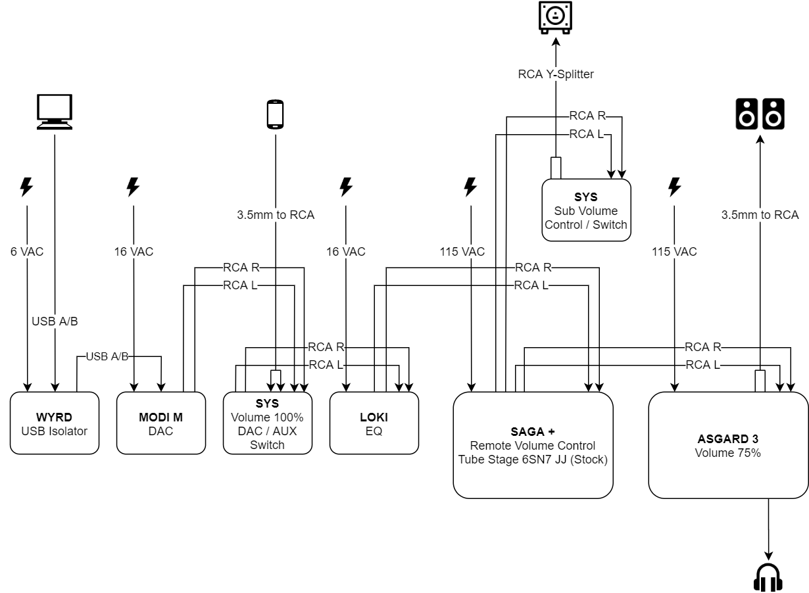

# February 6th, 2020

## Desk Audio

I wouldn't consider myself an audiophile per se; but I've always been curious
about the audiophile experience and having high quality music on tap has always
appealed to me. For the last few years I've used a Mayflower Electronics Desktop
Objective2 ODAC Rev B. and while I consider it execellent, I was looking for a
way of extending my system (adding speakers, eq, switches, etc.) I already own a
Schiit Vidar which I use in my home theater so I was familiar with the Schiit
brand and a fan of the modular nature of their components as well as their
aesthetic.

I set out to create a budget-ish, audiophile-quality audio setup for my desk
using Schiit separates. Convenience, tactility, and extensibility were key
objectives for me. I've designed this system with the intent of having easily
accessible analog controls for all aspects of the audio experience.

### Impressions

There is certainly a noticeable difference in the sound compared to the ODAC.
Since I haven't yet A/B tested anything, I can only comment on the system as a
whole; it sounds really good. The M1060s really opened up. Bass response is
better and the sound signature is warmer. I don't have a lot of reference nor
experience reviewing audio, so it's hard to comment much further honestly. The
primary reason that I wanted separates was so that I could swap in and out
components to analyze their impact. I look forward to doing that in a future
update.

Dead silence: when the Asgard, SYS volume is all the way down; the SYS is
switched to a null / muted source; or the Saga is muted. Turning the Saga down
all the way does not completely stop the sound.

## Components

### WYRD

:::tip Press Release
Wyrd isolates USB-input DACs from power supply noise from computer USB sources,
eliminating strange noises, dropouts, and power management problems with USB
audio interfaces.

Schiit has measured USB power supply noise up to 400mV p-p on computer USB
outputs. Wyrd replaces this “dirty” power with clean power from a linear supply
with ultra-low-noise (2.5uV) voltage regulators—more than 100,000x less than
what comes out of some USB ports. It also repeats the USB signal with a
low-jitter, 20ppm crystal oscillator, with its own local low-noise power supply
for higher performance.

“Some of our early listeners also claim that Wyrd improves sonic performance, as
well,” Jason continued. “But we’re not going to say this. Bottom line, it’s a
great way to solve some irritating USB audio interface problems. That’s it.”
:::

[Review and Measurements of Schiit WYRD USB Filter](https://www.audiosciencereview.com/forum/index.php?threads/review-and-measurements-of-schiit-wyrd-usb-filter.5717/)

I got the Wyrd for Christmas and was running it for over a year with my ODAC. I
A/B tested it (not blind) and could not tell a difference. I leave it in the
chain because it may prompt skeptics to listen more critically (and hear more
detail that's not necessarily attributable to the Wyrd itself :wink:).

### MODI Multibit

:::tip Press Release
“Modi Multibit smashes the price barrier in advanced multibit DACs,” said Mike
Moffat, Schiit’s Co-Founder and head of digital development. “It is the most
affordable multibit DAC built on a modern architecture—from any manufacturer, in
any country in the world.”

Modi Multibit is built on Schiit’s proprietary multibit DAC architecture,
featuring Schiit’s unique closed-form digital filter on an Analog Devices SHARC
DSP processor. For D/A conversion, it uses a medical/military grade, true
multibit converter specified down to 1/2LSB linearity, the Analog Devices
AD5547CRUZ.

Multibit DACs differ from the vast majority of DACs in that they use true 16-20
bit D/A converters that can reproduce the exact level of every digital audio
sample. Most DACs use inexpensive delta-sigma technology with a bit depth of
only 1-5 bits to approximate the level of every digital audio sample, based on
the values of the samples that precede and follow it.
:::

#### Compared to Modi 3

[Schiit Modi 3 vs. Modi Multibit – A Schiit Shootout!](https://audio-head.com/schiit-modi-3-vs-modi-multibit-a-schiit-shootout/)

The Multibit barely squeaks out with a win, but apparently it's not easy to tell
the difference between the two. Some have said that the Modi 3 is flat and
one-dimensional by comparison.

[Review: Battle of Schiit Audio DACs](https://www.audiosciencereview.com/forum/index.php?threads/review-battle-of-schiit-audio-dacs.5487/)

Looking at objective measurements, it appears that the Multibit produces a
considerably less faithful analog output of the digital samples its fed when
compared to the delta-sigma Modi 3. Multiple people have referred to this
analagously as tubes versus solid state, with the "tube" sound coming from the
Multibit.

### SYS

:::tip Product Description
SYS stands for "switch your, er...schtuff." Sys is a simple, 2-input passive
preamp. No electronics. No power. No distortion. Just a 2-way switch and a
potentiometer.
:::

[Review and Measurements of Schiit Sys Passive Pre-amp/Switcher](https://www.audiosciencereview.com/forum/index.php?threads/review-and-measurements-of-schiit-sys-passive-pre-amp-switcher.2335/)

The test results show flat, transparent performance so long as you're not using
a volume below 50% on the SYS and your non-selected input is muted.

I'm using the SYS to switch between inputs. With the satisfying press of a
button I can switch between my computer (Modi) and an AUX input (phone, DAP,
etc.). I've connected it upstream of everything besides the DAC so that all
benefits of the system (currently just Loki) are available to either source.

### LOKI

:::tip Press Release
Unlike old-school EQs of the 1980s, which and frequently had problems with noise
from stacks of op-amp gain stages and open-frame slider controls, Loki Mini is
designed for superior sound. A single, fully-discrete gain stage and a single
discrete buffer per channel is coupled with sealed Alps potentiometers, a 100%
linear power supply with +/-18V rails, and LC (inductor-capacitor) filtering to
keep performance high and noise low.

Loki Mini also features gentle control and rational ranges to allow for precise
and subtle tonal alterations. Potentiometers are progressive, so that a full 30
degrees is needed for the first dB of boost or cut. Loki Mini offers adjustment
center frequencies of 20 Hz, 400 Hz, 2kHz, and 8kHz. 20Hz and 8kHz offer +/-12dB
of adjustment, while 400Hz and 2kHz offer +/-6dB.

Loki Mini also offers a true bypass switch—one that simply connects the input to
the output, with no intervening circuitry. The front-mounted switch allows users
to compare the processed output to the “flat” output instantaneously.
:::

The Loki makes a 100% noticable impact on the sound, but it's an EQ; so it's
supposed to do that. You'd be expected to get cleaner results using software EQ,
but I really like the fact that this one is analog (and simple to use). Right
now I use it primarily as an easy-to-toggle bass boost for low listening
volumes (20 Hz and 400 Hz at 2 o' clock).

### SAGA+

:::tip Press Release 
Single ended passive or tube hybrid buffer remote controlled preamp with 64-step
relay stepped attenuator. Saga+ is an enhancement of the original Saga, with a
motorized potentiometer to track the remote control and DC heaters for even
lower noise. Like all Sagas and Freyas, it also features a relay-stepped
attenuator for volume control. 
:::

I'm running the stock 6SN7 JJ New Production tubes.

[A Four-Way Schiit Shootout – Freya S/+ Vs. Saga S/+](https://audio-head.com/a-four-way-schiit-shootout-freya-s-vs-saga-s/)

The Saga+ has an advertised output impedance of 180 ohms when running the
hybrid tube buffer stage. The Asgard 3 that I'm using has an input impedance of
22k ohms which should satisfy the 10:1 (load:source) rule...
 
[Review and Measurements of Schiit Saga Tube Pre-amp](https://www.audiosciencereview.com/forum/index.php?threads/review-and-measurements-of-schiit-saga-tube-pre-amp.6520/)
 
"Looking all the way to the right, the minimum impedance is 183 ohm. At the lower
end of 20 Hz, impedance climbs to 3,130 ohm. Using the typical 10:1 rule, your
power amplifier input impedance should be at least 30k ohm to avoid frequency
dependent/EQ changes. Put more simply, if you use lower input impedance power
amplifier after Saga in active mode, your low frequencies below 500 Hz or so
will attenuate. This may accentuate the rest of the spectrum you may like, or
not."

In active mode, low frequncies seem to drive the output impedance up
considerably; which puts my Asgard 3 a bit out of the recommended 30k ohm input
impedance range, but luckily I have the Loki to help correct that should I
notice it or just want to crank dat bass. :thumbsup:

Running in passive mode with the volume greater than 30% keeps the output
impedance below 2k ohm and in the desired range for the Asgard.

On the Schiit specs page for the Saga+ it says:

:::warning Specs
Outputs: 2 RCA pairs, selectable via front switch or remote
:::

I took that to mean that the output was switchable, but from the pictures and
manual that's clearly not the case. I intended to use the Saga+ to switch
between headphones and speakers, but now I'll likely use it to add a subwoofer
with another SYS for volume control. I'd like to test using an inverted SYS to
hopefully achieve the headphone / speaker toggle that I wanted out of the Saga+.
Regardless, I think I'd need to add another SYS if I want to avoid having to
unplug my headphones.

#### Hybrid Tube Buffer Stage vs Passive

[Tube Rolling of Schiit Saga Pre-amplifier](https://www.audiosciencereview.com/forum/index.php?threads/tube-rolling-of-schiit-saga-pre-amplifier.6522/)

Swapping between the passive and active modes produces almost no difference to
my ears. I *think** I prefer the active mode, it's almost unnoticeably louder
(:laughing:) and slightly warmer?

I'd like to try another tube (vintage?** to see if it changes the sound in a more
noticeable way.

### ASGARD 3

:::tip Press Release
Asgard 3 moves from Class A to Schiit's proprietary Continuity™ output stage,
shared with Lyr 3 and Aegir. Continuity extends the benefits of Class A outside
of the Class A bias region, addressing the problem of transconductance droop
identified by Bob Cordell and John Broskie. Asgard 3 runs 500mW of Class A bias,
so it's running Class A for most headphone loads. However, when required, it can
also deliver its full output of 3.5W RMS per channel into 32 ohms, both channels
driven.
:::

Schiit specifies a rating of 2.5W RMS per channel at 50 ohms - which is the
impedance of my M1060s. I have the volume set at 75% and it produces a good
listening volume on both my headphones and speakers with the Saga+ set
somewhere between 40% - 70%.

I have my speakers connected to the Asgard's preout so that they are muted while
I have headphones plugged in and resume playing when I unplug the headphones.

## Headphones / Speakers

### Monoprice M1060 v2

* Mods
  - Dekoni Audeze LCD Elite Hybrid pads
  - Removed outside foam

### Vanatoo Transparent Zero

Very clear with great imaging. For relatively small speakers, they vibrate my
desk with their basss.

## Cables

### Schiit PYST RCA

Super solid cables. I wish they sold longer lengths than 6 inches.

### Seismic Audio RCA

Premium Amazon cables. Good build quality and really flexible, although the
connectors can be a bit tight. Red like the PYST! Sadly not the same shade.

### SKW 3.5mm to RCA

Feels high quality; a little stiff.

### WAudio Power Cable

Thicc boys.

### Periapt TYPE 2 - DUAL 2.5MM

[Periapt TYPE 2 -DUAL 2.5MM](https://periaptcables.com/products/2-type-2-dual-2-5mm)

## Power Conditioner

Furman Power Station 8

<ClientOnly>
  <Disqus shortname="ethanaa" />
</ClientOnly>
